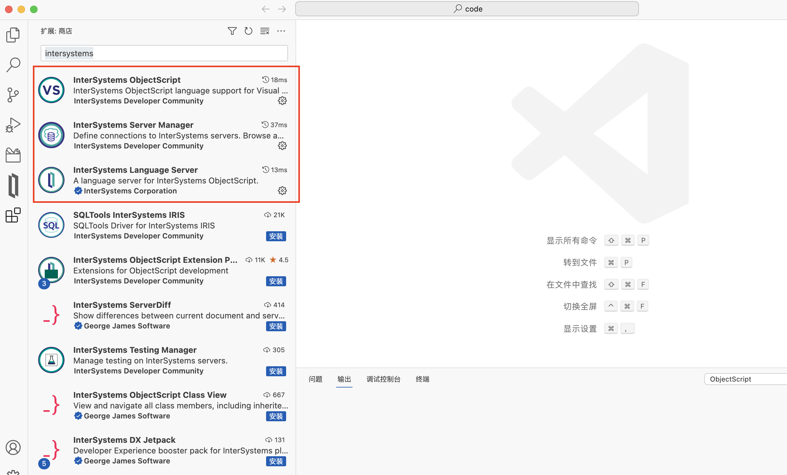
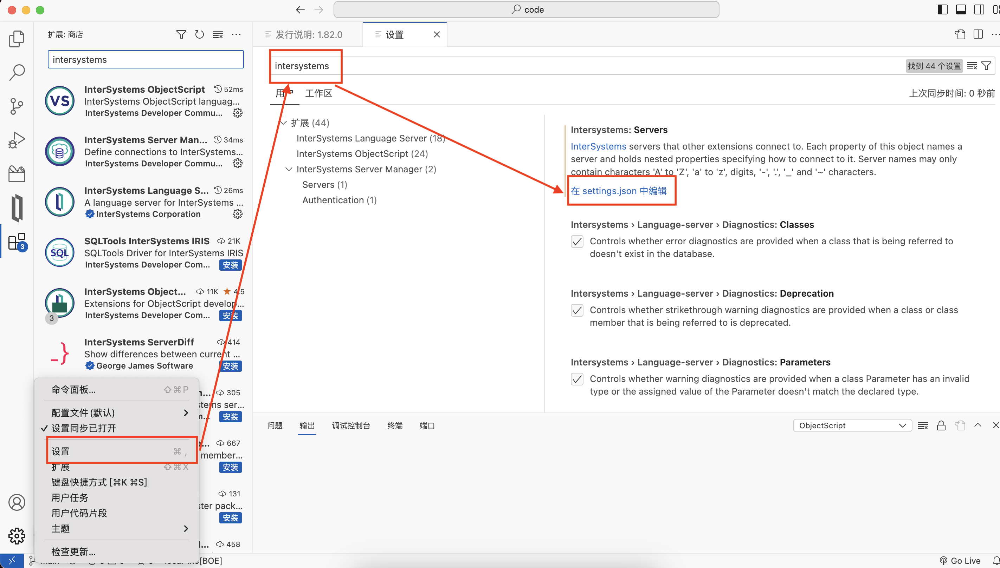
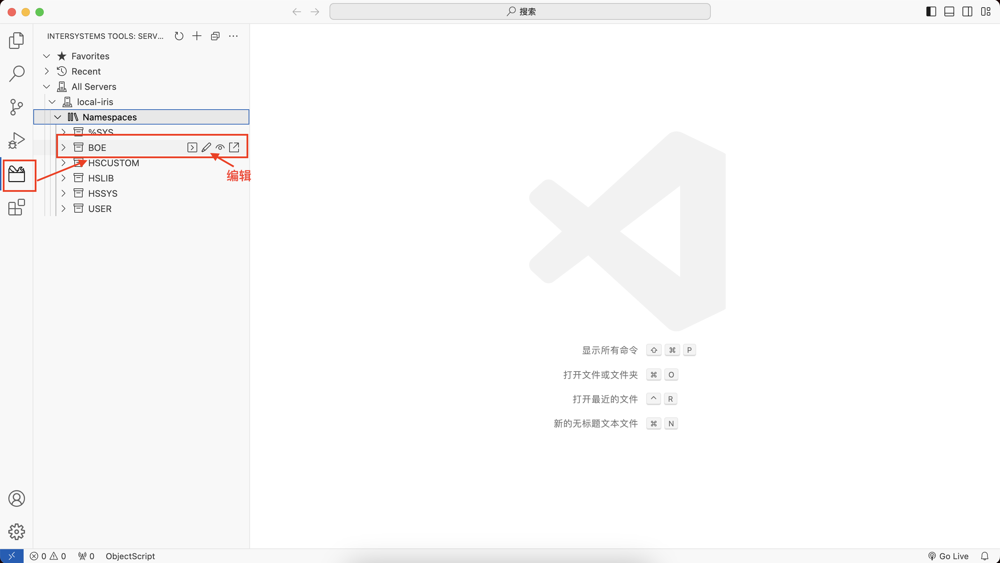
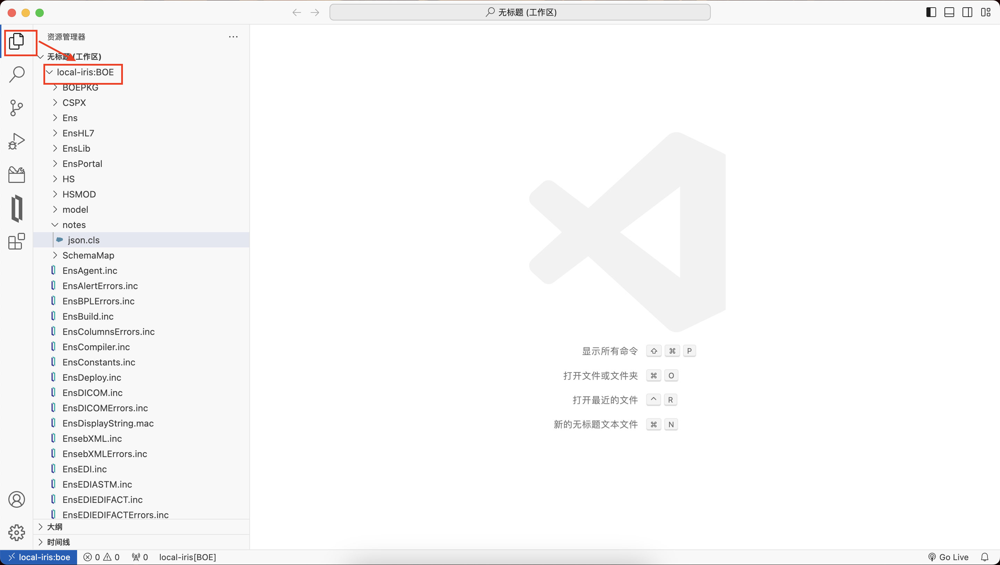
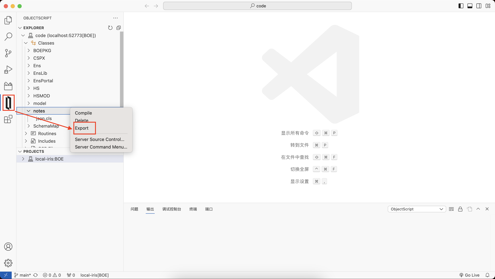
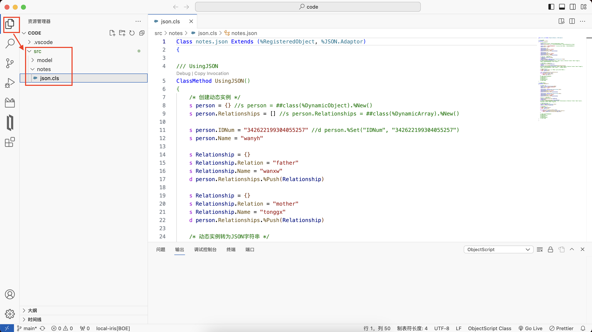

# 1. IRIS Docker的安装
```bash
$ docker pull containers.intersystems.com/intersystems/irishealth-community:latest-cd
5c939e3a4d10: Pull complete
c63719cdbe7a: Pull complete
19a861ea6baf: Pull complete
651c9d2d6c4f: Pull complete
d21839215a64: Pull complete
7995f836674b: Pull complete
841ee3aaa7aa: Pull complete
739c318c2223: Pull complete
d76886412dda: Pull complete
Digest: sha256:4c62690f4d0391d801d3ac157dc4abbf47ab3d8f6b46144288e0234e68f8f10e
Status: Downloaded newer image for containers.intersystems.com/intersystems/irishealth-community:latest-cd
containers.intersystems.com/intersystems/irishealth-community:latest-cd

$ docker run --name irishealth -d -p 1972:1972 -p 52773:52773 containers.intersystems.com/intersystems/irishealth-community:latest-cd

$ docker exec -it iris /bin/bash
irisowner@cb9383e4f127:~$ iris session iris
Node: cb9383e4f127, Instance: IRIS
USER>
```

# 2. 使用VSCode开发

1. 扩展安装



2. 配置

设置 -> 扩展 -> InterSystems Server Manager -> settings.json



```json
{
  "intersystems.servers": {
    "local-iris": {
      "webServer": {
        "scheme": "http",
        "host": "localhost",
        "port": 52773
      },
      "askForPassword": false,
      "username": "_system",
      "password": "SYS",
      "description": "local iris"
    }
  },
  "objectscript.conn": {
    "host": "localhost",
    "port": 52773,
    "username": "_system",
    "password": "SYS",
    "ns": "boe",
    "active": true,
    "server": "local-iris"
},
  "terminal.integrated.detectLocale": "on",
  "intersystems.language-server.diagnostics.routines": true,
  "editor.renderControlCharacters": false,
  "editor.unicodeHighlight.ambiguousCharacters": false,
  "git.autorefresh": false,
  "git.autoRepositoryDetection": false,
  "git.confirmEmptyCommits": false,
  "git.confirmForcePush": false,
  "git.confirmNoVerifyCommit": false,
  "git.confirmSync": false,
  "git.countBadge": "off",
  "diffEditor.wordWrap": "on",
  "editor.wordWrap": "on",
  "workbench.editor.enablePreview": false,
  "git.enableSmartCommit": true,
  "explorer.confirmDelete": false,
  "editor.fontSize": 13,
  "intersystemsServerManager.credentialsProvider.deletePasswordOnSignout": "never",
  "objectscript.showProposedApiPrompt": false,
  "workbench.startupEditor": "none",
  "intersystems.language-server.suggestTheme": false,
  "workbench.colorTheme": "Default Light Modern",
  "editor.tokenColorCustomizations":{
    "textMateRules": [
        {
            "scope": "entity.other.attribute-name.objectscript_class",
            "settings": {
                "foreground": "#000000"
            }
        },
        {
            "scope": "string.quoted.double.objectscript",
            "settings": {
                "foreground": "#068306"
            }
        },
        {
            "scope": ["comment.block.documentation.objectscript_class"],
            "settings": {
                "foreground": "#040482"
            }
        }
    ]
  }
}
```

3. 直连代码

   a. Instersystems tools – All Servers – 【服务器名】– NameSpace – 命名空间，选择要编辑的代码，点击编辑；
   

   

   b. 代码即可直接在工作区编辑。

   

4. 客户端方式

   a. 本地建立文件夹：`./iris/code`；

   b. vscode打开此文件夹；

   c. 点击ObjectScript图标，选择需要编辑的代码 - 右键 - 选择Export；

   

   d. 等待导出完毕，代码会出现在src目录下，可配置git进行代码管理。

   
