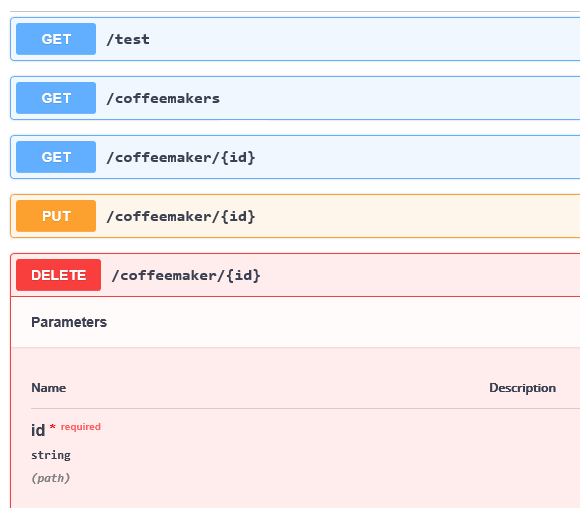
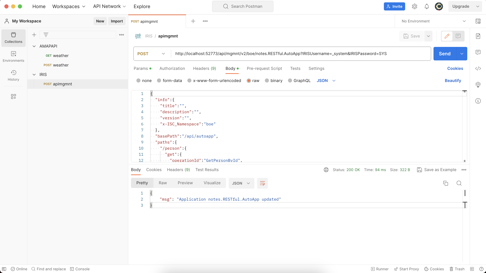
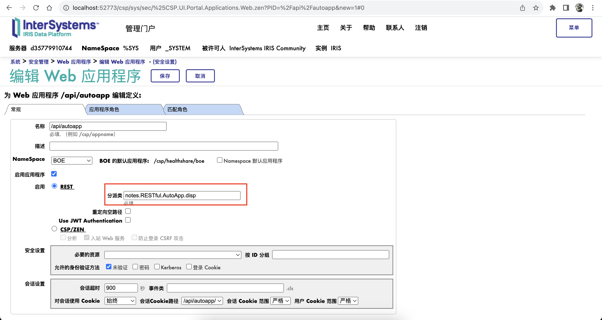
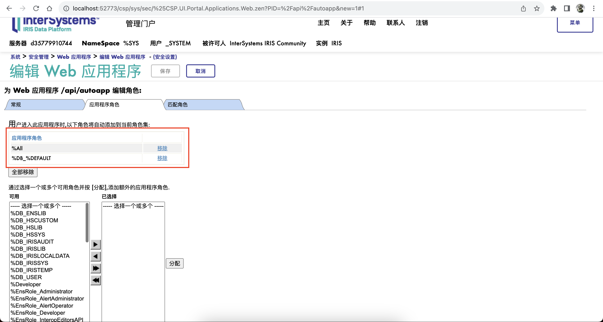
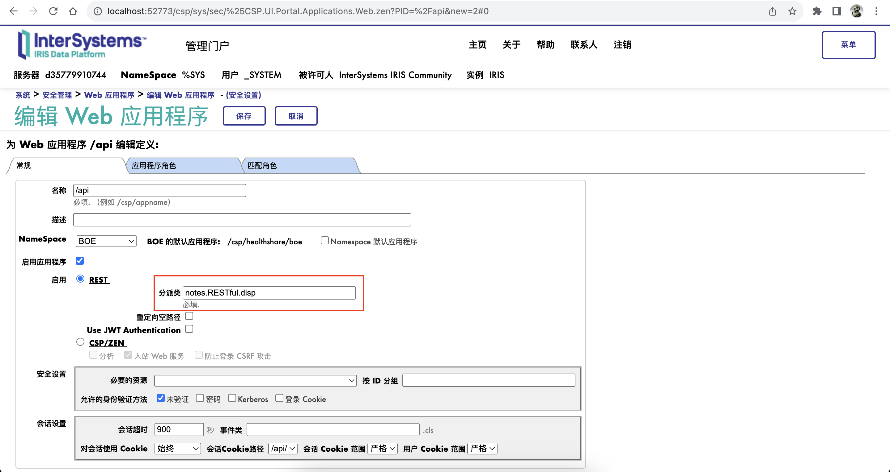
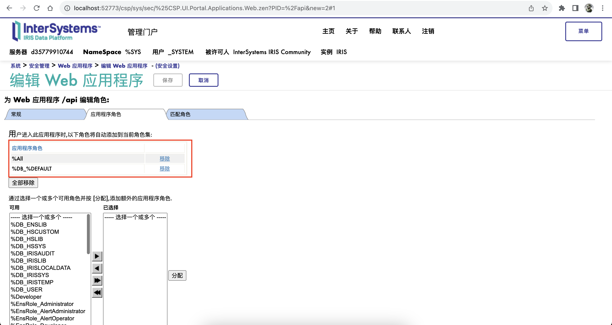

# 1 REST服务简介

本节介绍InterSystems IRIS®中的REST和REST服务。您可以将这些REST接口与UI工具（如Angular）一起使用，以提供对数据库和互操作性产品的访问。您还可以使用它们使外部系统能够访问InterSystems IRIS®数据平台应用程序。有关REST服务的交互式介绍，请尝试“开发REST接口”。

## 1.1 REST简介

REST是根据“代表性状态转移”命名的，具有以下属性：

- REST是一种体系结构风格，而不是一种格式。尽管REST经常使用HTTP来传输消息，使用JSON来传递数据，但您也可以将数据作为XML或纯文本传递。REST利用现有的web标准，如HTTP、URL、XML和JSON。

- REST是面向资源的。通常，资源由URL标识，并使用基于HTTP方法的操作，例如GET、POST、PUT和DELETE。
- REST通常开销很小。虽然它可以使用XML来描述数据，但它更常用的是JSON，这是一种轻量级的数据包装器。JSON使用标记标识数据，但标记没有在正式模式定义中指定，也没有明确的数据类型。

## 1.2 InterSystems REST服务简介

InterSystems IRIS 2019.2及更高版本中有两种定义REST接口的方法：

- 规范优先定义-首先创建OpenAPI 2.0规范，然后使用API管理工具生成REST接口的代码。
- 手动编码REST接口。

使用规范优先定义，InterSystems REST服务正式由以下组件组成：

- 规范类（`%REST.Spec`的子类）。此类包含REST服务OpenAPI 2.0规范。InterSystems支持可以在规范中使用的几个扩展属性。

- 分派类（`%CSP.REST`的子类）。此类负责接收HTTP请求并调用实现类中的适当方法。

- 实现类（`%REST.Impl`的子类）。此类定义实现REST调用的方法。

  API管理工具生成实现类的存根版本，然后将其扩展为包含必要的应用程序逻辑。（您的逻辑当然可以调用该类之外的代码。）

  `%REST.Impl`提供了可以调用的方法，以便设置HTTP标头、报告错误等。

- InterSystems web应用程序，通过InterSystems web网关提供对REST服务的访问。web应用程序被配置为启用REST访问并使用特定的分派类。web应用程序还控制对REST服务的访问。

InterSystems对这些组件遵循严格的命名约定。给定应用程序名称(`appname`)，规范、分派和实现类的名称分别为`appname.spec`、`appname.disp`和`appname.impl`。默认情况下，web应用程序名为`/csp/appname`，但可以使用其他名称。

InterSystems支持规范优先范式。您可以从规范中生成初始代码，当规范发生更改时（例如，通过获取新的端点），您可以重新生成该代码。后面的部分提供了更多详细信息，但现在请注意，您不应该编辑分派类，而是可以修改其他类。此外，当您重新编译规范类时，调度类会自动重新生成，实现类也会更新（保留您的编辑）。

### 1.2.1 手动编码REST服务

在2019.2之前的版本中，InterSystems IRIS不支持规范第一范式。REST服务在形式上仅由分派类和web应用程序组成。本书将REST服务定义为手动编码的REST服务。区别在于，由较新的REST服务定义的REST服务包含规范类，而手动编码的REST服务不包含规范类。本书的“手动创建REST服务”附录描述了如何使用手动编码范式创建REST服务。类似地，一些API管理实用程序使您能够使用手动编码的REST服务。

## 1.3 InterSystems API管理工具简介

为了帮助您更轻松地创建REST服务，InterSystems提供了以下API管理工具：

- 名为`/api/mgmnt`的REST服务，您可以使用它来发现服务器上的REST服务、生成OpenAPI 2.0规范的REST服务，以及在服务器上创建、更新或删除REST服务。
- `^%REST`例程，它提供了一个简单的命令行界面，可用于列出、创建和删除REST服务。
- `%REST.API`类，您可以使用它来发现服务器上的REST服务，生成OpenAPI 2.0规范的REST服务，以及在服务器上创建、更新或删除REST服务。

您可以为这些工具设置日志记录，如本章稍后所述。

有用的第三方工具包括REST测试工具，如PostMan(https://www.getpostman.com/）和Swagger编辑器(https://swagger.io/tools/swagger-editor/download/）。

## 1.4 创建REST服务概述

在InterSystems产品中创建REST服务的推荐方法大致如下：

1. 获取（或写入）Rest服务OpenAPI 2.0规范。
2. 使用API管理工具生成REST服务类和关联的web应用程序。请参阅“创建和编辑REST服务”
3. 修改实现类，使方法包含适当的业务逻辑。请参阅“修改实现类”一章
4. （可选）修改规范类。请参阅“修改规范类”一章。例如，如果您需要支持CORS或使用web会话，请执行此操作。
5. 如果需要安全性，请参阅“保护REST服务”一章
6. 使用Rest服务OpenAPI 2.0规范，生成文档，如“发现和记录REST API”一章所述

对于步骤2，另一个选项是手动创建规范类（将规范粘贴到其中），然后编译该类；这个过程生成分派和存根实现类。也就是说，严格来说，不必使用`/api/mgmnt`服务或`^%REST`例程。

## 1.5 深入了解REST服务类

本节详细介绍了规范、分派和实现类。

### 1.5.1 规范类

规范类旨在定义REST服务遵循的契约。此类扩展了`%REST.Spec`，并包含OpenAPI 2.0规范的REST服务XData块。以下是部分示例：

```java
Class petstore.spec Extends %REST.Spec [ ProcedureBlock ]
{

XData OpenAPI [ MimeType = application/json ]
{
{
  "swagger":"2.0",
  "info":{
    "version":"1.0.0",
    "title":"Swagger Petstore",
    "description":"A sample API that uses a petstore as an example to demonstrate features in the swagger-2.0 specification",
    "termsOfService":"http://swagger.io/terms/",
    "contact":{
      "name":"Swagger API Team"
    },
    "license":{
      "name":"MIT"
    }
  },
...
```

您可以通过替换或编辑XData块中的规范来修改此类。您还可以根据需要添加类参数、属性和方法。每当编译规范类时，编译器都会重新生成分派类并更新实现类（请参阅“InterSystems如何更新实现类”）。

### 1.5.2 分派类

当调用REST服务时，直接调用分派类。以下是部分示例：

```java
/// Dispatch class defined by RESTSpec in petstore.spec
Class petstore.disp Extends %CSP.REST [ GeneratedBy = petstore.spec.cls, ProcedureBlock ]
{

/// The class containing the RESTSpec which generated this class
Parameter SpecificationClass = "petstore.spec";

/// Default the Content-Type for this application.
Parameter CONTENTTYPE = "application/json";

/// By default convert the input stream to Unicode
Parameter CONVERTINPUTSTREAM = 1;

/// The default response charset is utf-8
Parameter CHARSET = "utf-8";

XData UrlMap [ XMLNamespace = "http://www.intersystems.com/urlmap" ]
{
<Routes>
  <Route Url="/pets" Method="get" Call="findPets" />
  <Route Url="/pets" Method="post" Call="addPet" />
  <Route Url="/pets/:id" Method="get" Call="findPetById" />
  <Route Url="/pets/:id" Method="delete" Call="deletePet" />
</Routes>
}

/// Override %CSP.REST AccessCheck method
ClassMethod AccessCheck(Output pAuthorized As %Boolean) As %Status
{
   ...
}

...

```

请注意，`SpecificationClass`参数指示关联的规范类的名称。`URLMapXData`块（URL映射）定义此REST服务中的调用。

在这些项之后，类包含URL映射中列出的方法的定义。这里有一个例子：

```java
ClassMethod deletePet(pid As %String) As %Status
{
    Try {
        If '##class(%REST.Impl).%CheckAccepts("application/json") Do ##class(%REST.Impl).%ReportRESTError(..#HTTP406NOTACCEPTABLE,$$$ERROR($$$RESTBadAccepts)) Quit
        If ($number(pid,"I")="") Do ##class(%REST.Impl).%ReportRESTError(..#HTTP400BADREQUEST,$$$ERROR($$$RESTInvalid,"id",id)) Quit
        Set response=##class(petstore.impl).deletePet(pid)
        Do ##class(petstore.impl).%WriteResponse(response)
    } Catch (ex) {
        Do ##class(%REST.Impl).%ReportRESTError(..#HTTP500INTERNALSERVERERROR,ex.AsStatus())
    }
    Quit $$$OK
}
```

请注意以下几点：

- 此方法调用实现类中同名的方法（本例中为`petstore.impl`）。它从该方法获取响应，并调用`%WriteResponse()`将响应写回调用者。`%WriteResponse()`方法是一个继承的方法，存在于所有实现类中，这些实现类都是`%REST.Impl`的子类。

- 此方法执行其他检查，如果出现错误，则调用`%REST.Impl`的其他方法。

> 重要：
> 因为分派类是一个生成的类，所以您永远不应该编辑它。InterSystems提供了一些机制，可以在不编辑分派类的情况下重写分派类的部分。

### 1.5.3 实现类

实现类用于保存REST服务的实际内部实现。你可以（也应该）编辑这个类。它最初看起来像以下示例：

```java
/// A sample API that uses a petstore as an example to demonstrate features in the swagger-2.0 specification<br/>
/// Business logic class defined by RESTSpec in petstore.spec<br/>
Class petstore.impl Extends %REST.Impl [ ProcedureBlock ]
{

/// If ExposeServerExceptions is true, then details of internal errors will be exposed.
Parameter ExposeServerExceptions = 0;

/// Returns all pets from the system that the user has access to<br/>
/// The method arguments hold values for:<br/>
///     tags, tags to filter by<br/>
///     limit, maximum number of results to return<br/>
ClassMethod findPets(tags As %ListOfDataTypes(ELEMENTTYPE="%String"), limit As %Integer) As %Stream.Object
{
    //(Place business logic here)
    //Do ..%SetStatusCode(<HTTP_status_code>)
    //Do ..%SetHeader(<name>,<value>)
    //Quit (Place response here) ; response may be a string, stream or dynamic object
}

...
```

实现类的其余部分包含与此类似的其他存根方法。在每一种情况下，这些存根方法都具有符合REST服务规范定义的契约的签名。注意，对于options方法，InterSystems不会生成存根方法供您实现。相反，`%CSP.REST`会自动执行所有选项处理。

## 1.6 为API管理功能启用日志记录

要启用API管理功能的日志记录，请在终端中输入以下内容：

```java
 set $namespace="%SYS"
 kill ^ISCLOG
 set ^%ISCLOG=5
 set ^%ISCLOG("Category","apimgmnt")=5
```

然后，系统将条目添加到`^ISCLOG`全局中，以便调用API管理端点。

要将日志写入文件（以便于阅读），请输入以下内容（仍在`%SYS`命名空间中）：

```java
 do ##class(%OAuth2.Utils).DisplayLog("filename")
```

其中`filename`是要创建的文件的名称。目录必须已存在。如果文件已存在，则将覆盖该文件。

要停止日志记录，请输入以下内容（仍在`%SYS`命名空间中）：

```java
 set ^%ISCLOG=0
 set ^%ISCLOG("Category","apimgmnt")=0
```

### 1.6.1 查看日志

启用HTTP请求日志记录后，日志条目将存储在`^ISCLOG`全局中，该全局位于`%SYS`命名空间中。

要使用管理门户查看日志，请导航到System Explorer>Globals并查看`ISCLOG`全局（而不是`%ISCOLOG`）。确保您位于`%SYS`命名空间中。


# 2 创建和编辑REST服务

有多种方法可以在InterSystems IRIS中创建和修改REST服务。这样做的三种主要方法是调用`/api/mgmnt/`服务、使用`^%REST例程`或使用`%REST.API`类。这三种创建REST服务的方法需要为REST服务创建OpenAPI 2.0（也称为Swagger）描述，以用于生成服务类。如果您正在实现由第三方定义的REST服务，他们可能会提供此OpenAPI 2.0描述。有关OpenAPI 2.0描述格式的详细信息，请参阅OpenAPI 2.0规范。

生成服务类后，请参阅修改实现类和修改规范类，以获取有关构建REST服务的更多说明。

## 2.1 使用/api/mgmnt/服务

创建、更新和删除REST服务的方法之一涉及调用/api/mgmnt/服务。

此服务还提供了用于列出和记录web服务的选项。

### 2.1.1 使用/api/mgmnt/创建REST服务

#### 2.1.1.1 使用/api/mgmnt/生成服务类

在第一步中，生成REST服务类，如下所示：

1. 以JSON格式创建或获取REST服务的OpenAPI 2.0描述。

2. 获取REST测试工具，如PostMan(https://www.getpostman.com）。

3. 在测试工具中，创建HTTP请求消息，如下所示：

   - 对于HTTP操作，选择或指定POST。

   - 对于URL，请指定以下格式的URL：

     http://localhost:52773/api/mgmnt/v2/namespace/myapp

     其中localhost是服务器的名称，52773是运行InterSystems IRIS的web服务器端口，namespace是要创建REST服务的命名空间，myapp是要创建类的包的名称。

   - 对于请求主体，以JSON格式粘贴web服务的OpenAPI 2.0描述。

   - 将请求主体类型指定为JSON（application/JSON）

   - 提供IRISUsername和IRISPassword参数的值。对于IRISUsername，请指定一个用户，该用户是%Developer角色的成员，并且具有对给定命名空间的读/写权限。

4. 发送请求消息。

   如果调用成功，InterSystems IRIS将在给定的包和命名空间中创建disp、impl和spec类。

5. 在测试工具中，检查响应消息。如果请求成功，响应消息将如下所示：

   ```java
   {
       "msg": "New application myapp created"
   }
   ```

#### 2.1.1.2 创建Web应用程序

在此步骤中，您将创建一个web应用程序，该应用程序提供对REST服务的访问。在管理门户中，完成以下步骤：

1. 点击System Administration > Security > Applications > Web Applications.

2. 点击 Create New Web Application.

3. 指定以下值：

   - **Name** — web应用程序的名称；这在InterSystems IRIS的这个实例中必须是唯一的。最常见的名称基于web应用程序运行的命名空间：/csp/namespace
   - **Namespace** — 选择生成类的命名空间。
   - **Enable Application** — 选中此复选框。
   - **Enable** — 选择**REST.**
   - **Dispatch Class** — 键入调度类的完全限定名称。这应该始终是package.disp，其中package是包含生成类的包的名称。

   有关此页面上其他选项的信息，请参阅创建应用程序。

4. 点击 **Save.**

### 2.1.2 使用/api/mgmnt/更新REST服务

InterSystems API管理工具使您能够更新生成的类，而无需更改对实现类的编辑。如果需要，将重新生成该类，但将保留您的编辑。

如果更新成功，InterSystems IRIS将重新生成给定包中的disp和spec类，并更新impl类，保留对该类所做的编辑。响应消息如下所示：

```java
{
    "msg": "Application myapp updated"
}
```

#### 2.1.2.1 InterSystems如何更新实现类

如果以前编辑过impl类，InterSystems将按如下方式保留这些编辑：

- 所有方法的实现都保持原样。
- 您添加的任何新类成员都保持原样。

但是，InterSystems会重新生成类和每个生成方法的描述（///注释）。如果任何实现方法的签名发生更改（例如，因为规范发生了更改），InterSystems将更新签名并向该类方法添加以下注释：

### 2.1.3 使用/api/mgmnt/删除REST服务

InterSystems API管理工具还允许您轻松删除REST服务。为此：

1. 使用REST测试工具，创建HTTP请求消息，如下所示：

   - 对于HTTP操作，选择或指定DELETE。

   - 对于URL，请指定以下格式的URL：

     http://localhost:52773/api/mgmnt/v2/namespace/myapp

     其中localhost是服务器的名称，52773是运行InterSystems IRIS的web服务器端口，namespace是要创建REST服务的命名空间，myapp是包含REST服务类的包的名称。

   - 提供IRISUsername和IRISPassword参数的值。对于IRISUsername，请指定一个用户，该用户是%Developer角色的成员，并且具有对给定命名空间的读/写权限。

2. 发送请求消息。

   如果调用成功，InterSystems IRIS将删除给定包和命名空间中的disp和spec类。

   然而，InterSystems IRIS不会删除impl类。

3. 在测试工具中，检查响应消息。如果请求成功，响应消息将如下所示：

   ```java
   {
       "msg": "Application myapp deleted"
   }
   ```

4. 手动删除实现类。

   为了安全起见，/api/mgmnt/服务不会自动删除实现类，因为该类可能包含大量自定义。

5. 删除以前为此REST服务创建的web应用程序（如果有）。为此：

   - 在管理门户中，单击**System Administration > Security > Applications > Web Applications**。
   - 在列出web应用程序的行中单击**Delete**。
   - 单击**OK**确认删除。


## 2.2 使用^%REST例程

^%REST例程是一个简单的命令行界面。在任何提示下，您都可以输入以下答案：

| **^**                              | 使例程跳回到上一个问题。           |
| ---------------------------------- | ---------------------------------- |
| **?**                              | 使例程显示列出所有当前选项的消息。 |
| **q** or **quit** （不区分大小写） | 结束例程。                         |

此外，每个问题都会在括号中显示该问题的默认答案。

### 2.2.1 使用^%REST创建服务

创建REST服务的推荐方法是从OpenAPI 2.0规范开始，并使用该规范生成REST服务类。要使用^%REST例程执行此操作：

1. 获取OpenAPI 2.0规范，以JSON格式打开。将规范保存为文件，或记录可以访问规范的URL。

2. 在终端中，更改为要定义REST服务的命名空间。

3. 输入以下命令以启动^%REST例程：

   ```java
   do ^%REST
   ```

4. 在第一个提示下，输入REST服务的名称。此名称用作生成类的包名称；请使用有效的包名称。如果要使用名称列表l、quit或q（在任何情况下都是变体），请将名称用双引号括起来。例如：“list”

5. 在下一个提示下，输入Y（不区分大小写）以确认是否要创建此服务。

   然后，例程会提示您输入要使用的OpenAPI 2.0规范的位置。输入完整路径名或URL。

6. 在下一个提示下，输入Y（不区分大小写）以确认要使用此规范。

   例程在此命名空间中的指定包中创建disp、impl和spec类。然后，例程显示如下输出：

   ```java
   -----Creating REST application: myapp-----
   CREATE myapp.spec
   GENERATE myapp.disp
   CREATE myapp.impl
   REST application successfully created.
   ```

   接下来，例程询问您是否也想创建web应用程序。您将使用此web应用程序访问REST服务。

7. 此时，可以执行以下操作：

   - 输入Y（不区分大小写）立即创建web应用程序。

   - 输入N（不区分大小写）结束例程。

     您可以单独创建web应用程序，如“创建web应用”中所述

8. 如果输入Y，则例程会提示您输入web应用程序的名称。

   该名称在此InterSystems IRIS实例中必须是唯一的。默认名称基于web应用程序运行的命名空间：/csp/namespace。

   输入web应用程序的名称或按回车键接受默认名称。

   然后，例程显示如下输出：

   ```java
   -----Deploying REST application: myapp-----
   Application myapp deployed to /csp/myapp
   ```

9. 如“修改实现类”一章所述定义实现

### 2.2.2 使用^%REST删除服务

要使用^%REST例程删除REST服务，请执行以下操作：

1. 在终端中，更改到可以找到REST服务的命名空间。

2. 输入以下命令以启动^%REST例程：

   ```java
   do ^%REST
   ```

3. 在第一个提示下，输入REST服务的名称。

   如果您不确定REST服务的名称，请输入L（不区分大小写）。该例程列出所有REST服务，然后再次提示您输入REST服务的名称。

4. 如果例程找到具有给定名称的REST服务，则会显示如下提示：

   ```java
   REST application found: petstore
   Do you want to delete the application? Y or N (N):
   ```

5. 输入Y（不区分大小写）以确认是否要删除此服务。

6. （可选）手动删除实现类。
   为了安全起见，例程不会自动删除实现类，因为该类可能包含大量自定义。


## 2.3 使用%REST.API类

本节介绍如何使用%REST.API类创建、更新和删除REST服务。

### 2.3.1 使用%REST.API类创建或更新服务

创建REST服务的推荐方法是从OpenAPI 2.0规范开始，并使用该规范生成REST服务类。使用%REST.API执行此操作：

1. 获取OpenAPI 2.0规范，以JSON格式打开，并将规范保存为文件。

2. 在要定义REST服务的命名空间中，使用该文件创建`%DynamicObject`的实例。

3. 然后调用`%REST.API`的`CreateApplication()`方法。此方法具有以下签名：

   ```java
   classmethod CreateApplication(applicationName As %String, 
                                 swagger As %DynamicObject = "", 
                                 ByRef features, 
                                 Output newApplication As %Boolean, 
                                 Output internalError As %Boolean) 
                                 as %Status
   
   ```

   Where:

   - applicationName是要在其中生成类的包的名称。

   - swagger是`%DynamicObject`的实例，表示OpenAPI 2.0规范。

     您还可以将此参数指定为规范的URL、包含规范的文件的路径名或空字符串。

   - 必须通过引用传递的features是一个多维数组，包含任何其他选项：

     如果features（“addPing”）为1，并且swagger为空字符串，则生成的类包含一个用于测试的ping()方法。

     如果features（“strict”）为1（默认值），则InterSystems将检查规范中的所有属性。如果特性（“strict”）为0，则只检查代码生成所需的属性。

   - newApplication（作为输出返回）是一个布尔值，指示该方法是创建了新应用程序（true）还是更新了现有应用程序。

   - internalError（作为输出返回）是一个布尔值，指示是否发生内部错误。

   如果该方法生成新的应用程序，InterSystems IRIS将在给定的包中创建disp、impl和spec类。

   如果该方法更新现有应用程序，InterSystems IRIS将重新生成给定包中的disp和spec类，并更新impl类，保留对该类所做的编辑。

   如果OpenAPI 2.0规范无效，则该方法不会进行任何更改。

4. 创建访问REST服务的web应用程序，如“创建和编辑REST服务”中所述。

5. 如“修改实现类”一章所述定义实现。

以下是第一步的示例：

```java
 set file="c:/2downloads/petstore.json"
 set obj = ##class(%DynamicAbstractObject).%FromJSONFile(file)
 do ##class(%REST.API).CreateApplication("petstore",.obj,,.new,.error)
 //examine error and decide how to proceed...
 ... 
```

### 2.3.2 使用%REST.API类删除服务

使用%REST.API删除REST服务，请执行以下操作：

1. 在可以找到REST服务的命名空间中，类中调用`%REST.API`的`DeleteApplication()`方法。此方法具有以下签名：

   ```java
   classmethod DeleteApplication(applicationName As %String) as %Status
   ```

   其中applicationName是包含REST服务类的包的名称。

2. （可选）手动删除实现类。

   为了安全起见，类方法不会自动删除实现类，因为该类可能包含大量自定义。

3. 删除以前为此REST服务创建的web应用程序（如果有）。为此：

   - 在管理门户中，单击**System Administration > Security > Applications > Web Applications**。
   - 在列出web应用程序的行中单击**Delete**。
   - 单击**OK**确认删除。


# 3 修改实现类

本章讨论如何修改REST服务的实现类。

本章假设您以前已经生成了REST服务类，如“创建和编辑REST服务”中所述。

## 3.1 初始方法定义

实现类最初包含存根方法，如下例所示：

```java
/// Returns all pets from the system that the user has access to<br/>
/// The method arguments hold values for:<br/>
///     tags, tags to filter by<br/>
///     limit, maximum number of results to return<br/>
ClassMethod findPets(tags As %ListOfDataTypes(ELEMENTTYPE="%String"), limit As %Integer) As %Stream.Object
{
    //(Place business logic here)
    //Do ..%SetStatusCode(<HTTP_status_code>)
    //Do ..%SetHeader(<name>,<value>)
    //Quit (Place response here) ; response may be a string, stream or dynamic object
}
```

在每一种情况下，这些存根方法都具有符合REST服务规范定义的契约的签名。


## 3.2 实施方法

对于实现类中的每个方法，根据使用它的REST调用的情况编辑方法定义（特别是实现）。请注意，该方法前面有一个注释，该注释是相应REST调用描述的副本。在实施过程中：

- 返回适当的值。
- 检查请求消息。为此，请使用实现类的`%CheckAccepts()`、`%GetContentType()`和`%GetHeader()`方法。这里提到的所有方法都继承自`%REST.Impl`，即实现类的超类。
- 根据需要设置HTTP状态代码，以指示资源是否可用。为此，请使用`%SetStatusCode()`方法。有关HTTP状态代码的信息，请参阅http://www.faqs.org/rfcs/rfc2068.html
- 设置HTTP响应标头。为此，请使用`%SetHeader()`、`%SetHeaderIfEmpty()`和`%DeleteHeader()`方法。
- 如果需要，报告错误。为此，请使用%LogError()方法。

有关这些方法的详细信息，请参阅`%REST.Impl`类引用。


## 3.3 公开服务器错误的详细信息

默认情况下，如果REST服务遇到内部错误，则不会向客户端报告错误的详细信息。要更改此设置，请将以下内容添加到实现类中，然后重新编译：

```java
Parameter ExposeServerExceptions = 1;
```

注意，默认的`%ReportRESTError()`方法检查此参数。如果覆盖该方法（请参见下一标题），则可以选择方法是否使用此参数。


## 3.4 修改错误响应

如果需要以非默认方式格式化错误响应，请重写实现类中的`%ReportRESTError()`方法。在方法中，使用`%WriteResponse()`方法返回错误响应。

有关这些方法的详细信息，请参阅`%REST.Impl`的类引用。


# 4 修改规范类

本章总结了如何以及为什么修改REST服务的规范类。

本章假设您以前已经生成了REST服务类，如“创建和编辑REST服务”中所述。

## 4.1 概述

下表列出了修改规范类的原因，并简要总结了所需的更改：

| 原因                                     | 变化                                                         |
| :--------------------------------------- | :----------------------------------------------------------- |
| 更新或替换规范                           | 手动或通过重新生成规范类来修改OpenAPI XData块。              |
| 启用REST服务以支持CORS                   | 手动修改OpenAPI XData块；还添加一个类参数并创建一个自定义分派超类。请参阅“在REST服务中支持CORS” |
| 启用REST服务以支持web会话                | 添加类参数。请参阅“将Web会话用于REST”一章                    |
| 指定使用端点所需的权限                   | 手动修改OpenAPI XData块。请参阅“保护REST服务”一章            |
| 重写默认内容类型、响应字符集或输入流处理 | 添加类参数。请参阅本章下一节。                               |
| 为服务方法指定非默认名称                 | 手动修改OpenAPI XData块。请参阅本章中的“重写服务方法的名称”。 |

每当编译规范类时，编译器都会在同一个包中重新生成分派类并更新实现类（请参阅“InterSystems如何更新实现类”）。


## 4.2 覆盖内容类型、响应字符集或输入流处理

只需向规范类添加类参数并重新编译，就可以覆盖REST服务的几个关键方面。

- 默认情况下，REST服务需要application/json内容类型。要覆盖此项，请将以下内容添加到规范类：

```java
Parameter CONTENTTYPE = "some-content-type";
```

其中*some-content-type*是MIME内容类型。

- 默认情况下，REST服务的响应消息采用UTF-8格式。要覆盖此项，请将以下内容添加到规范类：

```java
Parameter CHARSET = "some-character-set";
```

这里*some-character-set*是字符集的名称。

- 默认情况下，REST服务将输入字符流转换为Unicode。要不执行此操作，请将以下内容添加到规范类中：

```java
Parameter CONVERTINPUTSTREAM = 0";
```

然后重新编译。然后将这些更改复制到分派类。


## 4.3 重写服务方法的名称

默认情况下，编译器使用操作的`operationId`来确定相应REST调用调用的方法的名称。您可以指定其他名称。为此，在规范类的`OpenAPI XData`块中添加以下操作：

```java
"x-ISC_ServiceMethod":"alternatename"
```

例如：

```java
    "/pets":{
      "get":{
        "description":"Returns all pets from the system that the user has access to",
        "operationId":"findPets",
        "x-ISC_ServiceMethod":"ReturnPets",
        "produces":[
          "application/json",
          "application/xml",
          "text/xml",
          "text/html"
        ],

```

然后重新编译。然后编译器将这个新方法添加到分派和实现类中。一定要编辑实现类并为这个新方法提供一个实现。


## 4.4 在REST服务中支持CORS

跨源资源共享（CORS）允许在另一个域中运行的脚本访问服务。

通常，当浏览器从一个域运行脚本时，它允许对同一域进行`XMLHttpRequest`调用，但在对另一个域进行调用时不允许。这种浏览器行为限制某人创建恶意脚本，以滥用机密数据。恶意脚本可能允许用户使用授予用户的权限访问另一个域中的信息，但随后，在用户未知的情况下，对机密信息进行其他使用。为了避免这个安全问题，浏览器通常不允许这种跨域

如果不使用跨源资源共享（CORS），带有访问REST服务的脚本的网页通常必须与提供REST服务的服务器位于同一域中。在某些环境中，在不同于提供REST服务的服务器的域中使用脚本的网页是有用的。CORS支持这种安排。

下面提供了浏览器如何使用CORS处理`XMLHttpRequest`的简化描述：

1. 域`DomOne`中网页中的脚本包含对域`DomTwo`中的InterSystems IRIS REST服务的`XMLHttpRequest`。`XMLHttpRequest`具有CORS的自定义标头。
2. 用户查看此网页并运行脚本。用户的浏览器检测到与包含网页的域不同的域的`XMLHttpRequest`。
3. 用户的浏览器向InterSystems IRIS REST服务发送一个特殊请求，该请求指示`XMLHttpRequest`的HTTP请求方法和原始网页的域，在本例中为`DomOne`。
4. 如果请求被允许，则响应包含请求的信息。否则，响应仅包含指示CORS不允许请求的标头。

### 4.4.1 启用REST服务以支持COR概述

默认情况下，InterSystems REST服务不允许CORS标头。但是，您可以启用CORS支持。在REST服务中支持CORS有两个部分：

- 启用REST服务以接受部分或所有HTTP请求的CORS标头。请参阅“接受CORS标题”
- 编写代码，使REST服务检查CORS请求并决定是否继续。例如，您可以提供包含仅包含受信任脚本的域的允许列表。InterSystems IRIS为文档目的提供了一个简单的默认实现；此默认实现允许任何CORS请求。

> 重要：
>
> 默认的CORS标头处理不适用于处理机密数据的REST服务。

### 4.4.2 接受CORS 标头

要指定REST服务接受CORS标头，请执行以下操作：

1. 修改规范类以包含`HandleCorsRequest`参数。

   要为所有调用启用CORS标头处理，请将`HandleCorsRequest`参数指定为1：

   ```java
   Parameter HandleCorsRequest = 1;
   ```

   或者，要为某些调用而不是调用启用CORS标头处理，请将`HandleCorsRequest`参数指定为""（空字符串）：

   ```java
   Parameter HandleCorsRequest = "";
   ```

2. 如果将`HandleCorsRequest`参数指定为""，请编辑规范类中的`OpenAPI XData`块，以指示哪些调用支持CORS。具体来说，对于操作对象，添加以下属性名称和值：

   ```java
   "x-ISC_CORS":true
   ```

   例如，`OpenAPI XData`块可能包含以下内容：

   ```java
   "post":{
     "description":"Creates a new pet in the store.  Duplicates are allowed",
     "operationId":"addPet",
     "produces":[
       "application/json"
     ],
     ...
   
   ```

   添加`x-ISC_CORS`属性，如下所示：

   ```java
   "post":{
     "description":"Creates a new pet in the store.  Duplicates are allowed",
     "operationId":"addPet",
     "x-ISC_CORS":true, 
     "produces":[
        "application/json"
     ],
     ...
   
   ```

3. 编译规范类。此操作将重新生成分派类，从而导致行为的实际更改。无需详细了解分派类，但请注意以下更改：

   - 它现在包含`HandleCorsRequest`参数的值。
   - `URLMapXData`块现在包含与您修改的操作相对应的`<Route>`元素的`Cors=“true”`。

如果`HandleCorsRequest`参数为0（默认值），则对所有调用禁用CORS标头处理。在这种情况下，如果REST服务接收到带有CORS标头的请求，则该服务拒绝该请求。

> 重要：
>
> InterSystems IRIS REST服务支持OPTIONS请求（CORS预飞行请求），该请求用于确定REST服务是否支持CORS。发送此类请求的用户应该对REST服务使用的任何数据库具有READ权限。如果没有，服务将响应HTTP 404错误。在使用委托身份验证的配置中，请求将由经过身份验证的用户发送；在`ZAUTHENTICATE`例程中分配适当的权限。在不使用委托身份验证的配置中，此请求未经身份验证发送，并由CSPSystem用户执行；使用管理门户分配适当的权限。

### 4.4.3 定义如何处理CORS标头

当您启用REST服务接受CORS标头时，默认情况下，该服务接受任何CORS请求。REST服务应该检查CORS请求并决定是否继续。例如，您可以提供包含仅包含受信任脚本的域的允许列表。为此，您需要：

- 创建`%CSP.REST`的子类。在该类中，实现第一小节中描述的`OnHandleCorsRequest()`方法。
- 修改规范类并重新编译，重新生成分派类。

最终结果是分派类继承自您的自定义类，而不是`%CSP.REST`，因此使用了`OnHandleCorsRequest()`的定义，该定义覆盖了默认的CORS头处理。

#### 4.4.3.1 定义OnHandleCorsRequest()

在`%CSP.REST`的子类中，定义`OnHandleCorsRequest()`方法，该方法需要检查CORS请求并适当设置响应标头。

要定义此方法，您必须熟悉CORS协议的详细信息（此处未讨论）。

您还需要知道如何检查请求并设置响应标头。为此，检查默认使用的方法是有用的，`%CSP.REST`的`HandleDefaultCorsRequest()`方法。本节介绍了该方法如何处理源、凭据、头和请求方法，并提出了一些变化。您可以使用此信息编写`OnHandleCorsRequest()`方法。

以下代码获取源并使用它设置响应标头。一种可能的变化是根据允许列表测试原点。然后允许域，设置响应标头。如果没有，请将响应标头设置为空字符串。

```java
#; Get the origin
Set tOrigin=$Get(%request.CgiEnvs("HTTP_ORIGIN"))

#; Allow requested origin
Do ..SetResponseHeaderIfEmpty("Access-Control-Allow-Origin",tOrigin) 
```

以下行指定应包含授权标头。

```java
#; Set allow credentials to be true
Do ..SetResponseHeaderIfEmpty("Access-Control-Allow-Credentials","true")
```

以下行从传入请求中获取标头和请求方法。您的代码应该测试头和请求方法是否被允许。如果允许，请使用它们设置响应标头。如果没有，请将响应标头设置为空字符串。

```java
#; Allow requested headers
Set tHeaders=$Get(%request.CgiEnvs("HTTP_ACCESS_CONTROL_REQUEST_HEADERS"))
Do ..SetResponseHeaderIfEmpty("Access-Control-Allow-Headers",tHeaders)

#; Allow requested method
Set tMethod=$Get(%request.CgiEnvs("HTTP_ACCESS_CONTROL_REQUEST_METHOD"))
Do ..SetResponseHeaderIfEmpty("Access-Control-Allow-Method",tMethod)
```

> 重要：
>
> 默认的CORS标头处理不适用于处理机密数据的REST服务。

#### 4.4.3.2 修改规范类

在包含`OnHandleCorsRequest()`的`%CSP.REST`的自定义子类后，请执行以下操作：

1. 编辑规范类中的`OpenAPI XData`块，使信息对象包含名为`x-ISC_DispatchParent`的新属性。此属性的值必须是自定义类的完全限定名称。

   例如，假设`OpenAPI XData`块如下所示：

   ```java
     "swagger":"2.0",
     "info":{
       "version":"1.0.0",
       "title":"Swagger Petstore",
       "description":"A sample API that uses a petstore as an example to demonstrate features in the swagger-2.0 specification",
       "termsOfService":"http://swagger.io/terms/",
       "contact":{
         "name":"Swagger API Team"
       },
   ...
   ```

   假设`%CSP.REST`的自定义子类名为`test.MyDispatchClass`。在这种情况下，您将按如下方式修改XData块：

   ```java
     "swagger":"2.0",
     "info":{
       "version":"1.0.0",
       "title":"Swagger Petstore",
       "description":"A sample API that uses a petstore as an example to demonstrate features in the swagger-2.0 specification",
       "termsOfService":"http://swagger.io/terms/",
       "x-ISC_DispatchParent":"test.MyDispatchClass",
       "contact":{
         "name":"Swagger API Team"
       },
   ...
   ```

2. 编译规范类。此操作重新生成调度类。您将注意到该类现在扩展了您的自定义分派超类。因此，它将使用`OnHandleCorsRequest()`方法。


## 4.5 将Web会话与REST结合使用

REST的目标之一是无状态；也就是说，从一个REST调用到下一个调用，服务器上没有存储任何知识。跨REST调用保留web会话打破了无状态范式，但您可能希望保留web会话的原因有两个：

- 最小化连接时间-如果每个REST调用都创建一个新的web会话，则需要在服务器上建立一个新会话。通过保留web会话，REST调用连接速度更快。
- 跨REST调用保留数据-在某些情况下，跨REST调用保存数据可能是有效满足业务需求所必需的。

要启用在多个REST调用上使用单个web会话，请在规范类中将UseSession参数设置为1。例如：

```java
Parameter UseSession As Integer = 1;
```

然后重新编译这个类。

如果UseSession为1，则InterSystems IRIS将在多个REST服务调用之间保留web会话。如果参数为0（默认值），InterSystems IRIS将为每个REST服务调用使用新的web会话。

> 注：
>
> 重新编译规范类时，UseSession参数会复制到分派类，这会导致行为的实际变化。


# 5 保护REST服务

如果您的REST服务正在访问机密数据，则应该对该服务使用身份验证。如果需要为不同的用户提供不同级别的访问权限，还可以指定端点所需的权限。

本章假设您以前已经生成了REST服务类，如“创建和编辑REST服务”中所述。

## 5.1 为REST服务设置身份验证

您可以对InterSystems IRIS REST服务使用以下任何形式的身份验证：

- HTTP身份验证头-这是REST服务的推荐身份验证形式。
- Web会话身份验证-用户名和密码在URL中的问号后面指定。
- OAuth 2.0身份验证-请参阅以下小节。

### 5.1.1 REST应用程序和OAuth 2.0

要通过OAuth 2.0验证REST应用程序，请执行以下所有操作：

- 将包含REST应用程序的资源服务器配置为OAuth 2.0资源服务器。

- 允许%Service.CSP的委派身份验证。

- 确保web应用程序（针对REST应用程序）配置为使用委派身份验证。

- 在%SYS命名空间中创建名为`ZAUTHENTICATE`的例程。InterSystems提供了一个示例例程`REST.ZAUTHENTICATE.mac`，您可以复制和修改它。此例程是GitHub上Samples Security示例的一部分(https://github.com/intersystems/Samples-Security）。您可以按照“下载用于InterSystems IRIS的示例”中的描述下载整个示例，但只需在GitHub上打开例程并复制其内容可能会更方便。

  在例程中，修改applicationName的值，并根据需要进行其他更改。

另请参阅使用OAuth 2.0和OpenID Connect中的“使用InterSystems IRIS Web应用程序作为OAuth 2.0Client”一章中的“可选地为Web客户端定义委派身份验证”。

> 重要：
>
> 如果对HealthShare®使用身份验证，则必须使用InterSystems提供的`ZAUTHENTICATE`例程，并且不能自己编写。


## 5.2 指定使用REST服务所需的权限

为了指定执行代码或访问数据所需的权限，InterSystems技术使用基于角色的访问控制（RBAC）。有关详细信息，请参阅授权：控制用户访问。

如果需要为不同用户提供不同级别的访问权限，请执行以下操作以指定权限：

- 修改规范类以指定使用REST服务或REST服务中特定端点所需的权限；然后重新编译。特权是一种权限（如读或写），与资源的名称相结合。

  参见小节。

- 使用管理门户：

  - 定义在规范类中引用的资源。
  - 定义提供权限集的角色。例如，角色可以提供对端点的读访问或对不同端点的写访问。一个角色可以包含多组权限。
  - 将用户置于其任务所需的所有角色中。

此外，您可以使用`%CSP.REST`的`SECURITYRESOURCE`参数来执行授权。

### 5.2.1 指定权限

您可以为整个REST服务指定特权列表，也可以为每个端点指定特权列表。为此：

1. 要指定访问服务所需的权限，请编辑规范类中的OpenAPIXData块。对于信息对象，添加一个名为x-ISC_RequiredResource的新属性，其值是以逗号分隔的已定义资源及其访问模式（资源：模式）的列表，访问REST服务的任何端点都需要该列表。

   以下是一个示例：

   ```java
     "swagger":"2.0",
     "info":{
       "version":"1.0.0",
       "title":"Swagger Petstore",
       "description":"A sample API that uses a petstore as an example to demonstrate features in the swagger-2.0 specification",
       "termsOfService":"http://swagger.io/terms/",
       "x-ISC_RequiredResource":["resource1:read","resource2:read","resource3:read"],
       "contact":{
         "name":"Swagger API Team"
       },
   ...
   ```

2. 要指定访问特定端点所需的权限，请将x-ISC_RequiredResource属性添加到定义该端点的操作对象，如下例所示：

   ```java
         "post":{
           "description":"Creates a new pet in the store.  Duplicates are allowed",
           "operationId":"addPet",
           "x-ISC_RequiredResource":["resource1:read","resource2:read","resource3:read"],
           "produces":[
             "application/json"
           ],
           ...
   
   ```

3. 编译规范类。此操作重新生成调度类。

### 5.2.2 使用SECURITYRESOURCE参数

作为一个附加的授权工具，%CSP.REST的子类分派类具有SECURITYRESOURCE参数。SECURITYRESOURCE的值要么是资源及其权限，要么只是资源（在这种情况下，相关权限为Use）。系统检查用户是否对与SECURITYRESOURCE关联的资源具有所需的权限。

> 注：
>
> 如果分派类为SECURITYRESOURCE指定了一个值，并且CSPSystem用户没有足够的特权，那么这可能会导致登录尝试失败时出现意外的HTTP错误代码。为了防止这种情况发生，InterSystems建议您将指定资源的权限授予CSPSystem用户。


# 6 列出和记录REST API

本章讨论如何发现实例上可用的REST服务，以及如何为REST服务生成文档。

## 6.1 使用/api/mgmnt服务发现REST服务

/api/mgmnt服务包括用于发现REST服务类和支持REST的web应用程序的调用。

### 6.1.1 发现REST服务

要使用/api/mgmnt服务来发现实例上可用的REST服务，请使用以下REST调用：

- 对于HTTP操作，选择或指定GET。

- 对于URL，请指定以下格式的URL：

  http://localhost:52773/api/mgmnt/v2/

  或者，如果您只想检查一个命名空间：

  http://localhost:52773/api/mgmnt/v2/:namespace

  其中localhost是服务器的名称，52773是运行InterSystems IRIS的web服务器端口，namespace是您要检查的名称空间。

（请注意，这些调用忽略手动编码的REST服务。要发现手动编码的应用程序，请使用调用GET/api/mgmnt/和GET/api/mgmnt/:v1/:namespace/restapps。）

如果调用成功，InterSystems IRIS将返回一个以JSON格式列出REST服务的数组。例如：

```java
[
  {
    "name": "%Api.Mgmnt.v2",
    "webApplications": "/api/mgmnt",
    "dispatchClass": "%Api.Mgmnt.v2.disp",
    "namespace": "%SYS",
    "swaggerSpec": "/api/mgmnt/v2/%25SYS/%Api.Mgmnt.v2"
  },
  {
    "name": "myapp",
    "webApplications": "/api/myapp",
    "dispatchClass": "myapp.disp",
    "namespace": "USER",
    "swaggerSpec": "/api/mgmnt/v2/USER/myapp"
  }
]
```

### 6.1.2 发现支持REST的Web应用程序

要使用/api/mgmnt服务来发现实例上可用的支持REST的web应用程序，请使用以下REST调用：

- 对于HTTP操作，选择或指定GET。

- 对于URL，请指定以下格式的URL：

  http://localhost:52773/api/mgmnt

  或者，如果您只想检查一个命名空间：

  http://localhost:52773/api/mgmnt/v1/:namespace/restapps

  其中localhost是服务器的名称，52773是运行InterSystems IRIS的web服务器端口，namespace是您要检查的名称空间。

请参阅GET/api/mgmnt/和GET/api/mgmnt/:v1/:namespace/restapps的参考部分。


## 6.2 使用%REST.API类发现REST服务

%REST.API提供了可用于发现REST服务类和支持REST的web应用程序的方法。

### 6.2.1 发现REST服务类

要使用`%REST.API`来发现实例上可用的REST服务，请使用该类的以下方法：

**`GetAllRESTApps()`**

```java
GetAllRESTApps(Output appList As %ListOfObjects) as %Status
```

作为输出，返回此服务器上的REST服务列表。输出参数applist是`%ListOfObjects`的一个实例，列表中的每个项都是包含REST服务信息的`%REST.Application`的实例。这包括任何没有关联web应用程序的REST服务。此方法忽略任何手动编码的REST服务。

**`GetRESTApps()`**

```java
GetRESTApps(namespace as %String,
            Output appList As %ListOfObjects) as %Status
```

作为输出，返回名称空间中的REST服务列表。请参阅`GetAllWebRESTApps()`。请参阅`GetAllRESTApps()`。

### 6.2.2 发现支持REST的Web应用程序

要使用`%REST.API`来发现实例上可用的支持REST的web应用程序，请使用该类的以下方法：

**`GetAllWebRESTApps()`**

```java
GetAllWebRESTApps(Output appList As %ListOfObjects) as %Status
```

作为输出，返回此服务器上支持REST的web应用程序的列表。输出参数applist是`%ListOfObjects`的实例，列表中的每个项都是包含web应用程序信息`%REST.Application`的一个实例。

**`GetWebRESTApps()`**

```java
GetWebRESTApps(namespace as %String,
               Output appList As %ListOfObjects) as %Status
```

作为输出，返回名称空间中支持REST的web应用程序列表。请参阅`GetAllWebRESTApps()`。


## 6.3 为REST服务提供文档

记录任何API都很有用，这样开发人员就可以轻松地使用API。如果REST API遵循OpenAPI 2.0规范，则可以在开源框架中使用Swagger，根据规范内容为API提供交互式文档。

一种选择是使用SwaggerUI，并提供文档的托管副本。对于演示：

1. 去https://swagger.io/tools/swagger-ui/

2. 单击**Live Demo。**

3. 在页面顶部的框中，以JSON格式输入OpenAPI 2.0规范的URL。

   例如，在InterSystems IRIS服务器上使用GET/api/mgmnt/v2/:namespace/:application调用。

4. 单击**Explore.**

然后，页面的下部显示文档，如以下示例所示：



在这里，您可以查看每个呼叫的详细信息，尝试测试呼叫并查看响应。有关详细信息，请参阅网站中的Swagger。

其他第三方工具使您能够生成静态HTML。InterSystems对此没有具体建议。


# 7 /api/mgmnt/ API端点

此参考列出了/api/mgmnt/service中的端点，所有这些端点都适用于较新的REST服务。下表总结了端点，并指出它们是否也适用于手动编码的REST服务。

| 端点                            | 总结                                                         | 适用于NEWER REST服务？ | 适用于手动编码的REST服务？ |
| :------------------------------ | :----------------------------------------------------------- | :--------------------- | :------------------------- |
| DELETE /api/mgmnt/v2/:ns/:app   | 删除REST服务                                                 | YES                    | no                         |
| GET /api/mgmnt/                 | 列出此服务器上启用REST的web应用程序                          | YES                    | YES                        |
| GET /api/mgmnt/v1/:ns/restapps  | 列出命名空间中支持REST的web应用程序                          | YES                    | YES                        |
| GET /api/mgmnt/v1/:ns/spec/:app | 返回REST服务的OpenAPI 2.0规范                                | no                     | YES                        |
| GET /api/mgmnt/v2/              | 列出此服务器上的REST服务（包括任何没有关联web应用程序的服务） | YES                    | no                         |
| GET /api/mgmnt/v2/:ns           | 列出命名空间中的REST服务（包括任何没有关联web应用程序的服务） | YES                    | no                         |
| GET /api/mgmnt/v2/:ns/:app      | 返回REST服务的OpenAPI 2.0规范                                | YES                    | YES                        |

这里ns是一个命名空间，app是包含REST服务类的包的名称。

- DELETE /api/mgmnt/v2/:namespace/:application/ – 删除给定REST应用程序的类。请注意，此调用查找更新的REST服务。它忽略任何手动编码的REST服务。
- GET /api/mgmnt/ – 返回一个数组，该数组包含所有命名空间中支持REST的web应用程序的信息。
- GET /api/mgmnt/v1/:namespace/restapps – 返回一个数组，该数组包含给定命名空间中支持REST的web应用程序的信息。
- GET /api/mgmnt/v1/:namespace/spec/:application/ – 返回给定REST服务的OpenAPI 2.0规范，该服务必须是手动编码的REST服务。
- GET /api/mgmnt/v2/ – 返回一个数组，该数组包含有关服务器上较新REST服务的信息（包括任何没有关联web应用程序的服务）。此调用忽略任何手动编码的REST服务。
- GET /api/mgmnt/v2/:namespace/ – 返回一个数组，该数组包含给定命名空间中较新REST服务的信息（包括没有关联web应用程序的任何REST服务）。此调用忽略任何手动编码的REST服务。
- GET /api/mgmnt/v2/:namespace/:application/ – 返回给定REST服务的OpenAPI 2.0规范。REST服务可以是较新的REST服务，也可以是手动编码的REST服务。
- POST /api/mgmnt/v2/:namespace/:application – 给定Swagger（OpenAPI 2.0）规范，此调用为REST应用程序生成脚手架。


## 7.1 DELETE /api/mgmnt/v2/:namespace/:application/

删除给定REST应用程序的类。请注意，此调用查找更新的REST服务。它忽略任何手动编码的REST服务。

### URL参数

| namespace   | 必须的。命名空间名称。此参数不区分大小写。                   |
| ----------- | ------------------------------------------------------------ |
| application | 必须的。包含spec、impl和disp类的包的完全限定名称。此参数不区分大小写。 |

### 权限

若要使用此端点，您必须是`%Developer`角色的成员，并且必须具有对给定命名空间的读/写访问权限。

### 请求示例

- 请求方法：

  DELETE

- 请求URL:

  http://localhost:52773/api/mgmnt/v2/user/myapp

### 响应

此呼叫没有响应。


## 7.2 GET /api/mgmnt/

返回一个数组，该数组包含所有命名空间中支持REST的web应用程序的信息。

### URL参数

无

### 权限

若要使用此端点，必须具有对给定命名空间的读取权限。如果未指定命名空间，或者指定的命名空间为%SYS，则必须具有对默认命名空间（USER）的读取权限。注意，您可以将默认名称空间设置为不同的名称空间；为此，请将全局节点`^%SYS("REST","UserNamespace")`设置为所需的命名空间。

### 请求示例

- 请求方法：

  GET

- 请求URL:

  http://localhost:52773/api/mgmnt/

### 响应

响应是JSON数组；数组中的每个对象表示此服务器上的REST服务。具体来说，此调用检索有关此服务器上配置的所有支持REST的web应用程序的信息。它可以找到更新的和手动编码的REST服务。如果有REST服务类（更新的或手动编码的）没有关联的支持REST的web应用程序，则这些服务类不会包含在该响应中。

给定对象具有以下属性：

- name — 支持REST的web应用程序的名称。


- dispatchClass — REST服务的分派类的名称。具体来说，这是web应用程序的Dispatch class配置选项所指示的类。


- namespace — 在其中定义分派类的命名空间。


- resource — 使用此REST服务所需的InterSystems IRIS资源的名称。


- swaggerSpec — 可以获取此REST服务的OpenAPI 2.0规范的端点。


- enabled — 指定是否启用REST服务。

以下是示例响应：

```java
[
    {
        "name": "/api/atelier",
        "dispatchClass": "%Api.Atelier",
        "namespace": "%SYS",
        "resource": "%Development",
        "swaggerSpec": "/api/mgmnt/v1/%25SYS/spec/api/atelier",
        "enabled": true
    },
    {
        "name": "/api/deepsee",
        "dispatchClass": "%Api.DeepSee",
        "namespace": "%SYS",
        "resource": "",
        "swaggerSpec": "/api/mgmnt/v1/%25SYS/spec/api/deepsee",
        "enabled": true
    },
    {
        "name": "/api/docdb",
        "dispatchClass": "%Api.DocDB",
        "namespace": "%SYS",
        "resource": "",
        "swaggerSpec": "/api/mgmnt/v1/%25SYS/spec/api/docdb",
        "enabled": true
    },
    {
        "name": "/api/iknow",
        "dispatchClass": "%Api.iKnow",
        "namespace": "%SYS",
        "resource": "",
        "swaggerSpec": "/api/mgmnt/v1/%25SYS/spec/api/iknow",
        "enabled": true
    },
    {
        "name": "/api/mgmnt",
        "dispatchClass": "%Api.Mgmnt.v2.disp",
        "namespace": "%SYS",
        "resource": "",
        "swaggerSpec": "/api/mgmnt/v1/%25SYS/spec/api/mgmnt",
        "enabled": true
    },
    {
        "name": "/api/uima",
        "dispatchClass": "%Api.UIMA",
        "namespace": "%SYS",
        "resource": "",
        "swaggerSpec": "/api/mgmnt/v1/%25SYS/spec/api/uima",
        "enabled": true
    },
    {
        "name": "/webapp/simple2",
        "dispatchClass": "simple2.disp",
        "namespace": "USER",
        "resource": "",
        "swaggerSpec": "/api/mgmnt/v1/USER/spec/webapp/simple2",
        "enabled": true
    }
]
```


## 7.3 GET /api/mgmnt/v1/:namespace/restapps

返回一个数组，该数组包含所有命名空间中支持REST的web应用程序的信息。

### URL参数

无

### 权限

若要使用此端点，必须具有对给定命名空间的读取权限。如果未指定命名空间，或者指定的命名空间为%SYS，则必须具有对默认命名空间（USER）的读取权限。注意，您可以将默认名称空间设置为不同的名称空间；为此，请将全局节点`^%SYS("REST","UserNamespace")`设置为所需的命名空间。

### 请求示例

- 请求方法：

  GET

- 请求URL:

  http://localhost:52773/api/mgmnt/v1/user/restapps

### 响应

响应是JSON数组；阵列中的每个对象表示支持REST的web应用程序。有关详细信息，请参阅GET/api/mgmnt/。


## 7.4 GET /api/mgmnt/v1/:namespace/spec/:application/

返回OpenAPI 2.0规范，该服务必须是手动编码的REST服务。

### URL参数

| namespace   | 必需的。命名空间名称。此参数不区分大小写。 |
| ----------- | ------------------------------------------ |
| application | 必需的。包含REST服务类的包的完全限定名称。 |

### 权限

若要使用此端点，必须具有对给定命名空间的读取权限。如果未指定命名空间，或者指定的命名空间为%SYS，则必须具有对默认命名空间（USER）的读取权限。注意，您可以将默认名称空间设置为不同的名称空间；为此，请将全局节点`^%SYS("REST","UserNamespace")`设置为所需的命名空间。

您还必须具有对包含分派类的数据库的读取权限。分派类名称空间和端点名称空间必须相同（包中以%开头的分派类除外，所有名称空间都可以使用）。

### 请求示例

- 请求方法：

  GET

- 请求URL:

  http://localhost:52773/api/mgmnt/v1/user/spec/myapp

### 响应

此调用返回Swagger（OpenAPI 2.0）规范，如https://github.com/OAI/OpenAPI-Specification/blob/master/versions/2.0.md。


## 7.5 GET /api/mgmnt/v2/

返回一个数组，该数组包含有关服务器上较新REST服务的信息（包括任何没有关联web应用程序的服务）。此调用忽略任何手动编码的REST服务。

### URL参数

无

### 权限

若要使用此端点，必须具有对给定命名空间的读取权限。如果未指定命名空间，或者指定的命名空间为%SYS，则必须具有对默认命名空间（USER）的读取权限。注意，您可以将默认名称空间设置为不同的名称空间；为此，请将全局节点`^%SYS("REST","UserNamespace")`设置为所需的命名空间。

### 请求示例

- 请求方法：

  GET

- 请求URL:

  http://localhost:52773/api/mgmnt/v2/

### 响应

响应是JSON数组；数组中的每个对象都表示REST服务。给定对象具有以下属性：

- name — REST服务的名称。


- webApplications — 提供对REST服务的访问的web应用程序的名称。


- dispatchClass — REST服务的分派类的名称。


- namespace — 在其中定义分派类和其他类的命名空间。


- swaggerSpec — 可以获取此REST服务的OpenAPI 2.0规范的端点。

以下是示例响应：

```java
[
  {
    "name": "%Api.Mgmnt.v2",
    "webApplications": "/api/mgmnt",
    "dispatchClass": "%Api.Mgmnt.v2.disp",
    "namespace": "%SYS",
    "swaggerSpec": "/api/mgmnt/v2/%25SYS/%Api.Mgmnt.v2"
  },
  {
    "name": "myapp",
    "webApplications": "/api/myapp",
    "dispatchClass": "myapp.disp",
    "namespace": "USER",
    "swaggerSpec": "/api/mgmnt/v2/USER/myapp"
  }
]
```


## 7.6 GET /api/mgmnt/v2/:namespace/

返回一个数组，该数组包含给定命名空间中较新REST服务的信息（包括没有关联web应用程序的任何REST服务）。此调用忽略任何手动编码的REST服务。

### URL参数

| namespace | 必需的。命名空间名称。此参数不区分大小写。 |
| --------- | ------------------------------------------ |


### 权限

若要使用此端点，必须具有对给定命名空间的读取权限。如果未指定命名空间，或者指定的命名空间为%SYS，则必须具有对默认命名空间（USER）的读取权限。注意，您可以将默认名称空间设置为不同的名称空间；为此，请将全局节点`^%SYS("REST","UserNamespace")`设置为所需的命名空间。

### 请求示例

- 请求方法：

  GET

- 请求URL:

  http://localhost:52773/api/mgmnt/v2/%25sys

### 响应

响应是JSON数组；数组中的每个对象都表示REST服务。有关详细信息，请参阅“GET/api/mgmnt/v2/”

以下是示例响应：

```java
[
  {
    "name": "%Api.Mgmnt.v2",
    "webApplications": "/api/mgmnt",
    "dispatchClass": "%Api.Mgmnt.v2.disp",
    "namespace": "%SYS",
    "swaggerSpec": "/api/mgmnt/v2/%25SYS/%Api.Mgmnt.v2"
  }
]
```


## 7.7 GET /api/mgmnt/v2/:namespace/:application/

返回OpenAPI 2.0规范。REST服务可以是较新的REST服务，也可以是手动编码的REST服务。

### URL参数

| namespace   | 必须的。命名空间名称。此参数不区分大小写。                   |
| ----------- | ------------------------------------------------------------ |
| application | 必须的。包含spec、impl和disp类的包的完全限定名称。此参数不区分大小写。 |


### 权限

若要使用此端点，必须具有对给定命名空间的读取权限。如果未指定命名空间，或者指定的命名空间为%SYS，则必须具有对默认命名空间（USER）的读取权限。注意，您可以将默认名称空间设置为不同的名称空间；为此，请将全局节点`^%SYS("REST","UserNamespace")`设置为所需的命名空间。

您还必须具有对包含分派类的数据库的读取权限。分派类名称空间和端点名称空间必须相同（包中以%开头的分派类除外，所有名称空间都可以使用）。

### 请求示例

- 请求方法：

  GET

- 请求URL:

  http://localhost:52773/api/mgmnt/v2/user/myapp

### 响应

此调用返回Swagger（OpenAPI 2.0），如https://github.com/OAI/OpenAPI-Specification/blob/master/versions/2.0.md中：

- host始终设置为您调用的服务器的server:port。
- basePath被设置为分派到该REST应用程序的第一个web应用程序。如果没有web应用程序分派到此REST应用程序，则返回basePath，如.spec类中所示。


# 8 OpenAPI属性

本节列出了OpenAPI 2.0规范的属性在API管理工具生成REST服务类时的使用。此处未列出的属性将被忽略。有几个扩展属性；这些名称以`x-ISC`开头。

## 8.1 Swagger

- basePath


- consumes


- host


- produces


- definitions (注意，API管理工具在生成代码时不使用Schema对象的任何属性)


- parameters (有关详细信息，请参阅“Parameter Object”)


- paths (有关详细信息，请参阅“Path Item Object”)


- info (有关详细信息，请参阅“Info Object”)


- swagger (必须为“2.0”)

有关这些属性的详细信息，请参阅https://github.com/OAI/OpenAPI-Specification/blob/master/versions/2.0.md#swagger-object

## 8.2 Info Object

- title


- description


- x-ISC_RequiredResource (以逗号分隔的已定义资源及其访问模式（资源：模式）列表，这些资源是访问REST服务的任何端点所需的)


- version

有关这些属性的详细信息，请参阅https://github.com/OAI/OpenAPI-Specification/blob/master/versions/2.0.md#swagger-object

## 8.3 Path Item Object

- $ref


- get, put, and so on (OpenAPI 2.0规范支持的所有方法)

  注意，对于options方法，InterSystems不会生成存根方法供您实现。相反，`%CSP.REST`会自动执行所有选项处理。

- parameters (有关详细信息，请参阅 “Parameter Object”)

有关这些属性的详细信息，请参阅https://github.com/OAI/OpenAPI-Specification/blob/master/versions/2.0.md#swagger-object

## 8.4 Operation Object

- operationId


- summary


- description


- consumes


- produces


- parameters (有关详细信息，请参阅 “Parameter Object”)


- x-ISC_CORS (一个标志，指示应支持此端点/方法组合的CORS请求)


- x-ISC_RequiredResource (以逗号分隔的已定义资源及其访问模式（资源：模式）列表，访问REST服务的此端点所需)


- x-ISC_ServiceMethod (在后端调用的用于服务此操作的类方法的名称；默认值是operationId，这通常是合适的)


- responses (注意，在响应对象中，状态可以是HTTP状态代码或“default”)

有关这些属性的详细信息，请参阅https://github.com/OAI/OpenAPI-Specification/blob/master/versions/2.0.md#swagger-object

## 8.5 Parameter Object

- name
- in
- description
- required
- $ref
- type (不能为“formData”；允许使用其他类型)
- format
- allowEmptyValue
- maxLength
- minLength
- pattern
- maximum
- minimum
- exclusiveMaximum
- exclusiveMinimum
- multipleOf
- collectionFormat
- minItems
- maxItems
- uniqueItems
- items (有关详细信息，请参阅 “Items Object”)

有关这些属性的详细信息，请参阅https://github.com/OAI/OpenAPI-Specification/blob/master/versions/2.0.md#swagger-object

## 8.6 Items Object

- type
- format
- allowEmptyValue
- maxLength
- minLength
- pattern
- maximum
- minimum
- exclusiveMaximum
- exclusiveMinimum
- multipleOf
- collectionFormat
- minItems
- maxItems
- uniqueItems

有关这些属性的详细信息，请参阅https://github.com/OAI/OpenAPI-Specification/blob/master/versions/2.0.md#swagger-object


# 9 手动创建REST服务

本章描述了如何通过`%CSP.REST`的子类来手动创建InterSystems IRIS®REST服务；此过程创建了一个手动编码的REST服务，该服务不能与所有API管理工具一起使用。

另请参阅“保护REST服务”中的“为REST服务设置身份验证”

## 9.1 手动创建REST服务的基础知识

要手动定义REST服务，请执行以下操作：

- 创建一个REST服务类-`%CSP.REST`的子类。在子类中：

  - 定义一个URL映射，该映射指定 指定为`REST URL和HTTP方法`执行的InterSystems IRIS方法。
  - （可选）指定`UseSession`参数。此参数控制每个REST调用是在其自己的web会话下执行，还是与其他REST调用共享单个会话。
  - 可选地，重写错误处理方法。

  如果要将实现代码与分派代码分开，可以在单独的类中定义实现REST服务的方法，并从URL映射中调用这些方法。

- 定义一个使用REST服务类作为其分派类的web应用程序。

  要定义web应用程序及其安全性，请转到**Web Application**页面(**System Administration > Security > Applications > Web Applications**)。

  定义web应用程序时，将`DispatchClass`设置为REST服务类的名称。

  此外，将应用程序的名称指定为REST调用URL的第一部分。示例名称为`/csp/mynamespace`或`/csp/myapp`，但您可以指定URL中允许的任何文本。

您可以在命名空间中定义多个REST服务类。每个具有自己入口点的REST服务类都必须有自己的web应用程序。


## 9.2 创建URL映射

在REST服务类中，定义一个名为`UrlMap`的XData块，该块将REST调用与实现服务的方法相关联。它可以根据URL的内容直接将调用发送给方法，也可以根据URL将调用转发给另一个REST服务类。如果web应用程序正在处理少量相关服务，则可以将调用直接发送给实现它的方法。但是，如果web应用正在处理大量不同的服务，则可定义单独的REST服务类，每个类处理一组相关服务。然后将web应用程序配置为使用一个中央REST服务类，该类将REST调用转发到其他适当的REST服务类。

如果`%CSP.REST`子类直接向方法发送调用，则`URLMap`包含一个包含一系列`＜Route＞`元素的`＜Routes＞`定义。每个`＜Route＞`元素指定要为指定的URL和HTTP操作调用的类方法。REST通常使用GET、POST、PUT或DELETE操作，但您可以指定任何HTTP操作。URL可以选择包含作为REST URL的一部分指定的参数，并作为参数传递给指定的方法。

如果`%CSP.REST`子类正在将调用转发到`%CSP.REST`的其他子类，则`UrlMap`包含包含一系列`<Map>`元素的`<Routes>`定义。`<Map>`元素将具有指定前缀的所有调用转发到另一个REST服务类，然后该类将实现该行为。它可以通过将调用直接发送到方法或将其转发到另一个子类来实现该行为。

> 重要：
>
> InterSystems IRIS将传入的`REST URL`与每个`＜Route＞`的URL属性和每个`＜Map＞`的Prefix属性进行比较，从URL映射中的第一项开始，并在使用相同HTTP请求方法的第一个可能匹配处停止。因此，`<Routes>`中元素的顺序很重要。如果传入的URL可以匹配URL映射的多个元素，则InterSystems IRIS使用第一个匹配元素，并忽略任何后续可能的匹配

### 9.2.1 `URLMap <Route>`元素

InterSystems IRIS将传入的URL和HTTP请求方法与URL映射中的每个`＜Route＞`元素进行比较。它调用第一个匹配的`＜Route＞`元素中指定的方法。`<Route>`元素有三部分：

- `Url` — 指定调用REST服务的REST Url的最后一部分的格式。Url由文本元素和以":"(冒号)开头的参数组成。
- `Method` — 指定REST调用的HTTP请求方法：通常是GET、POST、PUT或DELETE，但可以使用任何HTTP请求方法。您应该选择适合服务执行的函数的请求方法，但%CSP.REST不会对不同的方法执行任何特殊处理。您应该以所有大写字母指定HTTP请求方法。
- `Call` — 指定要调用以执行REST服务的类方法。默认情况下，该类方法在REST服务类中定义，但您可以显式指定任何类方法。

例如，考虑以下`<Route>`：

```java
<Route Url="/echo" Method="POST" Call="Echo" Cors="false" />
```

这指定REST调用将以`/echo`结束，并使用`POST`方法。它将调用定义REST服务的`REST.DocServer`类中的`Echo`类方法。Cors属性是可选的；有关详细信息，请参阅“修改REST服务以使用CORS”。

完整的REST URL由以下部分组成：

- InterSystems IRIS服务器的服务器名称和端口。在本章中，服务器名称和端口`http://localhost:52773/`在示例中使用。
- **Web Application**页面上定义的web应用程序的名称（单击**System Administration > Security > Applications > Web Applications**）。（例如，`/csp/samples/docserver`）
- `<Route>`元素的Url属性。如果Url属性的段前面有":"(冒号)，则表示参数。参数将匹配该URL段中的任何值。此值作为参数传递给方法。

对于前面的示例，TCP跟踪实用程序显示的完整REST调用是：

```java
POST /csp/samples/docserver/echo HTTP/1.1
Host: localhost:52773
```

如果要在分派代码中将实现REST服务的代码与`%CSP.REST`分开，可以在另一个类中定义实现REST服务方法，并在Call元素中指定类和方法。

#### 9.2.1.1 指定参数

以下`＜Route＞`定义在URL中定义了两个参数，命名空间和类：

```java
<Route Url="/class/:namespace/:classname" Method="GET" Call="GetClass" />
```

REST调用URL以`/csp/samples/docserver/class/`开头，URL的下两个元素指定这两个参数。`GetClass()`方法使用这些参数作为要查询的命名空间和类名。例如，考虑此REST调用：

```java
http://localhost:52773/csp/samples/docserver/class/samples/Cinema.Review

```

此REST调用`GetClass()`方法，并传递字符串“`samples`”和“`Cinema.Review`”作为参数值。`GetClass()`方法具有以下签名：

```java
/// This method returns the class text for the named class
ClassMethod GetClass(pNamespace As %String,
                     pClassname As %String) As %Status
{
```

#### 9.2.1.2 为单个URL指定多个路由

对于给定的URL，您可以支持不同的HTTP请求方法。您可以为每个HTTP请求定义单独的ObjectScript方法，也可以使用检查请求的单个ObjectScript方法。

以下示例对单个URL的每个HTTP请求方法使用不同的方法：

```java
<Route Url="/request" Method="GET" Call="GetRequest" />
<Route Url="/request" Method="POST" Call="PostRequest" />
```

使用这些路由，如果使用HTTPGET方法调用URL`/csp/samples/docserver/request`，则会调用`GetRequest()`方法。如果使用HTTP POST方法调用它，则会调用`PostRequest()`方法。

相反，您可以使用以下`<Route>`定义：

```java
<Route Url="/request" Method="GET" Call="Request" />
<Route Url="/request" Method="POST" Call="Request" />
```

在这种情况下，`Request()`方法处理GET或POST操作的调用。该方法检查%request对象，该对象是`%CSP.Request`的实例。在此对象中，URL属性包含URL的文本。

#### 9.2.1.3 路由映射的正则表达式

可以在路由映射中使用正则表达式。InterSystems建议，只有在没有其他方法来定义REST服务以满足您的需求时，才能这样做。本节提供了详细信息。（有关ObjectScript中正则表达式的信息，请参见使用ObjectScript中的“正则表达式”。）

在内部，用于在URL中定义参数的：`parameter-name`语法是使用正则表达式实现的。指定为：`parameter-name`的每个段都将转换为包含重复匹配组的正则表达式，特别是`([^/]+)`正则表达式。此语法匹配任何字符串（非零长度），只要该字符串不包含/（斜杠）字符。因此，`GetClass()`示例`Url="/class/:namespace/:classname"`相当于：

```java
<Route Url="/class/([^/]+)/([^/]+)" Method="GET" Call="GetClass" />
```

其中存在指定两个参数的两个匹配组。

在大多数情况下，这种格式提供了足够的灵活性来指定RESTURL，但是高级用户可以直接在路由定义中使用正则表达式格式。URL必须与正则表达式匹配，并且由一对括号指定的每个匹配组都定义了要传递给该方法的参数。

例如，考虑以下路由映射：

```java
<Routes>
<Route Url="/Move/:direction" Method="GET" Call="Move" />
<Route Url="/Move2/(east|west|north|south)" Method="GET" Call="Move" />
</Routes>
```

对于第一条路由，参数可以具有任何值。无论参数的值是多少，都会调用`Move()`方法。对于第二条路由，参数必须是东西北或南；如果使用其他参数值调用第二个路由，则不会调用`Move()`方法，REST服务将返回404错误，因为找不到资源。

这个简单的示例只是为了演示常用参数语法和正则表达式之间的区别。在这里讨论的情况下，不需要正则表达式，因为`Move()`方法可以（并且应该）检查参数的值并做出适当的响应。但是，在以下情况下，正则表达式很有用：

- 如果参数是可选的。在这种情况下，请使用正则表达式`([^/]\*)`而不是：`parameter-name`语法。例如：

  ```java
  <Route Url="/Test3/([^/]*)" Method="GET" Call="Test"/>
  ```

  当然，被调用的方法还必须能够处理参数的空值。

- 如果参数是最后一个参数，并且其值可以包含斜线。在这种情况下，如果需要参数，请使用正则表达式`((?s).*)`而不是：`parameter-name`语法。例如：

  ```java
  <Route Url="/Test4/((?s).+)" Method="GET" Call="Test"/>
  ```

  或者，如果此参数是可选的，请使用正则表达式`((?s).*)`而不是：`parameter-name`语法。例如：

  ```java
  <Route Url="/Test5/((?s).*)" Method="GET" Call="Test"/>
  ```

### 9.2.2 `URLMap <Map>`元素

InterSystems IRIS将传入的URL与URL映射中每个`<Map>`元素中的前缀进行比较。它将传入的REST调用转发到第一个匹配的`<Map>`元素中指定的REST服务类。该类处理URL的其余部分，通常调用实现服务的方法。`<Map>`元素有两个属性：

- Prefix — 指定要匹配的URL段。传入URL通常在匹配段之后具有其他段。
- Forward — 指定将处理匹配段后面的URL段的另一个REST服务类。

考虑以下包含三个`<Map>`元素的`URLMap`。

```java
XData UrlMap
{
  <Routes>
    <Map Prefix="/coffee/sales" Forward="MyLib.coffee.SalesREST"/>
    <Map Prefix="/coffee/repairs" Forward="MyLib.coffee.RepairsREST"/>
    <Map Prefix="/coffee" Forward="MyLib.coffee.MiscREST"/>
  </Routes>
}
```

此`UrlMap`将REST调用转发到三个REST服务类之一：`MyLib.coffee.SalesREST`、`MyLib.coffe.RepairsREST`或`MyLib.cofee.MiscREST`。

调用这些REST服务之一的完整REST URL由以下部分组成：

- InterSystems IRIS服务器的服务器名称和端口，例如`http://localhost:52773/`

- `Web Application`页面上定义的web应用程序的名称（单击**System Administration > Security > Applications > Web Applications**）。例如，这些REST调用的web应用程序可以命名为`/coffeeRESTSvr`

- `<Map>`元素的前缀。

- REST URL的其余部分。这是接收转发的REST请求的REST服务类将处理的URL。

例如，以下REST调用：

```java
http://localhost:52773/coffeeRESTSvr/coffee/sales/reports/id/875
```

将第一个`<Map>`与前缀`/coffee/sales`匹配，并将REST调用转发到`MyLib.coffee.SalesREST`类。该类将查找URL剩余部分“`/reports/id/875`”的匹配项。

作为另一个示例，以下REST调用：

```java
http://localhost:52773/coffeeRESTSvr/coffee/inventory/machinetype/drip
```

将第三个`<Map>`与前缀`/coffee`匹配，并将REST调用转发到`MyLib.coffee.MiscREST`类。该类将查找URL其余部分的匹配项，“`/inventory/machinetype/drop`”。

> 注：
>
> 在这个`URLMap`示例中，如果前缀为“`/coffee`”的`<Map>`是第一个映射，那么所有带有`/coffee`的REST调用都将被转发到`MyLib.coffee.MiscREST`类，即使它们匹配以下`<Map>`元素之一。`<Routes>`中`<Map>`元素的顺序很重要。


## 9.3 指定数据格式

您可以定义REST服务来处理不同格式的数据，例如JSON、XML、文本或CSV。REST调用可以通过在HTTP请求中指定ContentType元素来指定它希望发送的数据的形式，也可以通过在HTTP请求中指定Accept元素来请求返回数据格式。

在`DocServer`示例中，`GetNamespaces()`方法检查REST调用是否请求了以下JSON数据：

```java
If $Get(%request.CgiEnvs("HTTP_ACCEPT"))="application/json"
```


## 9.4 本地化REST服务

REST服务返回的任何字符串值都可以本地化，以便服务器以不同的语言存储字符串的多个版本。然后，当服务接收到包含`HTTP Accept Language`标头的HTTP请求时，服务将使用字符串的适当版本进行响应。

要本地化REST服务，请执行以下操作：

1. 在实现代码中，不要包含硬编码的文本字符串，而是使用`$$Text`宏的实例，为宏参数提供如下值：

   - 默认字符串

   - （可选）此字符串所属的域（当字符串分组到域中时，本地化更易于管理）

   - （可选）默认字符串的语言代码

    例如，不是这样：

     ```java
      set returnvalue="Hello world"
     ```

     包括以下内容：

     ```java
      set returnvalue=$$$TEXT("Hello world","sampledomain","en-us")
     ```

2. 如果省略`$$Text`宏的域参数，请在REST服务类中包含`domain`类参数。例如：

   ```java
   Parameter DOMAIN = "sampledomain"
   ```

3. 编译代码。这样做时，编译器会在消息字典中为`$$Text`宏的每个唯一实例生成条目。

   消息字典是全局的，因此可以在管理门户中轻松查看（例如）。有一些类方法可以帮助完成常见任务。

4. 开发完成后，导出该域或所有域的消息字典。

   结果是一个或多个包含原始语言文本字符串的XML消息文件。

5. 将这些文件发送给翻译人员，请求翻译版本。

6. 当您收到翻译后的XML消息文件时，将它们导入到导出原始文件的同一命名空间中。

   翻译文本和原文在信息字典中共存。

7. 在运行时，REST服务根据`HTTP Accept Language`标头选择要返回的文本。

有关更多信息，请参阅文章字符串本地化和消息字典。


## 9.5 将Web会话与REST结合使用

有关介绍，请参阅本书前面的“将Web会话用于REST”。

要使REST服务在多个REST调用上使用单个web会话，请在REST服务类中将`UseSession`参数设置为1：

```java
Parameter UseSession As Integer = 1;
```


## 9.6 支持CORS

有关简介，请参阅本书前面的“CORS简介”。请注意，如本附录所述，手动创建web服务时，支持CORS的细节略有不同。

### 9.6.1 修改REST服务以使用CORS

要指定REST服务支持CORS，请按如下方式修改REST服务类，然后重新编译它。

1. 指定`HandleCorsRequest`参数的值。

   要为所有调用启用CORS标头处理，请将`HandleCorsRequest`参数指定为1：

   ```java
   Parameter HandleCorsRequest = 1;
   ```

   或者，要为某些调用而不是调用启用CORS标头处理，请将`HandleCorsRequest`参数指定为""（空字符串）：

   ```java
   Parameter HandleCorsRequest = "";
   ```

   （如果`HandleCorsRequest`为0，则对所有调用禁用CORS标头处理。在这种情况下，如果REST服务接收到带有CORS标头的请求，则该服务拒绝该请求。这是默认值。）

2. 如果将`HandleCorsRequest`参数指定为""，请编辑`URLMapXData`块以指示哪些调用支持CORS。具体而言，对于任何应支持CORS的`<Route>`，请添加以下属性名称和值：

   ```java
   Cors="true"
   ```

   或者在`<Route>`元素中指定`Cors=“false”`以禁用Cors处理。

如果REST服务类将REST请求转发给另一个REST服务类，则CORS处理的行为由包含与给定请求匹配的`＜Route＞`元素的类确定。

### 9.6.2 覆盖CORS标头处理

> 重要：
>
> 默认的CORS标头处理不适用于处理机密数据的REST服务。

默认的CORS头处理不进行任何过滤，只是将CORS头传递给外部服务器并返回响应。您可能希望限制对域允许列表中源的访问，或限制允许的请求方法。您可以通过重写REST服务类中的`OnHandleCorsRequest()`方法来实现这一点。

有关实现`OnHandleCorsRequest()`方法的信息，请参阅本书前面的“定义`OnHandleCorsRequest()`”。

注意，所有与`UrlMap`中的`＜Route＞`元素匹配的URL请求都使用类中定义的单个`OnHandleCorsRequest()`方法处理。如果对于不同的RESTURL请求需要不同的`OnHandleCorsRequest()`方法实现，则应使用`Forward`将请求发送到其他REST服务类。


## 9.7 变体：访问查询参数

向REST服务传递参数的推荐方法是将它们作为用于调用服务的URL路径的一部分传递（例如，`/myapi/someresource/parametervalue`）。然而，在某些情况下，将参数作为查询参数传递可能更方便（例如，`/myapi/someresource?parameter=value`）。在这种情况下，可以使用`%request`变量来检索参数值。在REST服务中，`%request`变量是`%CSP.Request`的一个实例，它位于保存整个URL查询。要检索给定查询参数的值，请使用以下语法：

```java
$GET(%request.Data(name,1),default)
```

其中`name`是查询参数的名称，`default`是要返回的默认值。或者，如果同一URL包含同一查询参数的多个副本，请使用以下语法：

```java
$GET(%request.Data(name,index),default)
```

其中index是要检索的副本的数字索引。有关详细信息，请参阅`%CSP.REST`的类引用。


## 9.8 示例：Hello World！

以下代码片段代表REST服务的一个极其简单的示例。有三个类：`helloWorld.disp`、`helloWorld.impl`和`helloWorld.hwObj`。虽然`helloWorld.disp`和`helloWorld.impl`扩展`%CSP.REST`以建立REST服务，但`helloWorld.hwObj`扩展`%Persistent`，和`%JSON.Adaptor`，这在使用POST方法创建对象时非常有用。

```java
Class helloWorld.disp Extends %CSP.REST
{

Parameter HandleCorsRequest = 0;

XData UrlMap [ XMLNamespace = "https://www.intersystems.com/urlmap" ]
{
<Routes>
    <Route Url="/hello" Method="GET" Call="Hello" />
    <Route Url="/hello" Method="POST" Call="PostHello" />
</Routes>
}

ClassMethod Hello() As %Status
{
    Try {
        Do ##class(%REST.Impl).%SetContentType("application/json")
        If '##class(%REST.Impl).%CheckAccepts("application/json") Do ##class(%REST.Impl).%ReportRESTError(..#HTTP406NOTACCEPTABLE,$$$ERROR($$$RESTBadAccepts)) Quit
        Set response=##class(helloWorld.impl).Hello()
        Do ##class(%REST.Impl).%WriteResponse(response)
    } Catch (ex) {
        Do ##class(%REST.Impl).%SetStatusCode("400")
        return {"errormessage": "Client error"}
    }
    Quit $$$OK
}

ClassMethod PostHello() As %Status
{
    Try {
        Do ##class(%REST.Impl).%SetContentType("application/json")
        If '##class(%REST.Impl).%CheckAccepts("application/json") Do ##class(%REST.Impl).%ReportRESTError(..#HTTP406NOTACCEPTABLE,$$$ERROR($$$RESTBadAccepts)) Quit
        Set response=##class(helloWorld.impl).PostHello()
        Do ##class(%REST.Impl).%WriteResponse(response)
    } Catch (ex) {
        Do ##class(%REST.Impl).%SetStatusCode("400")
        return {"errormessage": "Client error"}
    }
    Quit $$$OK
}
```

请注意上述分派类的结构：`URLMap`定义了不同方法的不同端点，并且存在将这些路由分派到实现类的类方法。在此过程中，该类执行一些错误处理。阅读有关文档中`%REST.Impl`中报告错误和设置状态代码的详细信息。作为POST或PUT方法端点的类方法需要参数中使用特殊的`%request`，并将所述参数中的信息传递给实现方法。

```java
Class helloWorld.impl Extends %CSP.REST
{

ClassMethod Hello() As %DynamicObject
{
    Try {
       return {"Hello":"World"}.%ToJSON()
    } Catch (ex) {
        Do ##class(%REST.Impl).%SetStatusCode("500")
        return {"errormessage": "Server error"}
   }
}

ClassMethod PostHello(body As %DynamicObject) As %DynamicObject
{
    Try {
        set temp = ##class(helloWorld.hwobj).%New()
        Do temp.%JSONImport(body)
        Do temp.%Save()
        Do temp.%JSONExportToString(.ret)
        return ret
    } Catch (ex) {
        Do ##class(%REST.Impl).%SetStatusCode("500")
        return {"errormessage": "Server error"}
   }
}

}
```

上面的示例实现类有两个方法，一个简单地返回一个JSON格式的“HelloWorld”消息，另一个基于一些输入创建一个对象，然后返回所述对象的内容。有关分别使用`%new()`和`%JSONImport()`等方法的详细信息，请参阅`%Persistent`和`%JSON.Adapter`的文档。

尽管`helloWorld.hwobj`类可以有许多属性，但为了简化本例，它只有一个属性：

```java
Class helloWorld.hwobj Extends (%Persistent, %JSON.Adaptor)
{

Property Hello As %String;

Storage Default
{
<Data name="hwobjDefaultData">
<Value name="1">
<Value>%%CLASSNAME</Value>
</Value>
<Value name="2">
<Value>Hello</Value>
</Value>
</Data>
<DataLocation>^helloWorld.hwobjD</DataLocation>
<DefaultData>hwobjDefaultData</DefaultData>
<IdLocation>^helloWorld.hwobjD</IdLocation>
<IndexLocation>^helloWorld.hwobjI</IndexLocation>
<StreamLocation>^helloWorld.hwobjS</StreamLocation>
<Type>%Storage.Persistent</Type>
}

}
```

按照“创建REST服务的基础知识”中的说明在管理门户中配置Web应用程序后，手动使用`Postman`或任何其他REST客户端向Web应用程序发送请求并查看其响应。

# 附：OpenAPI 2.0规范创建REST服务示例

## 生成服务类：`/api/mgmnt`

`http://localhost:52773/api/mgmnt/v2/boe/notes.RESTful.AutoApp?IRISUsername=_system&IRISPassword=SYS`



## 应用程序：`/api/autoapp`





## 规范类：`notes.RESTful.AutoApp.spec`

```java
Class notes.RESTful.AutoApp.spec Extends %REST.Spec [ ProcedureBlock ]
{

XData OpenAPI [ MimeType = application/json ]
{
{
  "info":{
    "title":"",
    "description":"",
    "version":"",
    "x-ISC_Namespace":"boe"
  },
  "basePath":"/api/autoapp",
  "paths":{
    "/resource":{
      "get":{
        "operationId":"GetResourceById",
        "description":" GET http://localhost:52773/api/autoapp/resource ",
        "x-ISC_ServiceMethod":"GetResourceById",
        "responses":{
          "default":{
            "description":"(Unexpected Error)"
          },
          "200":{
            "description":"(Expected Result)"
          }
        }
      },
      "post":{
        "operationId":"CreateResource",
        "description":" POST http://localhost:52773/api/autoapp/resource ",
        "x-ISC_ServiceMethod":"CreateResource",
        "parameters":[
          {
            "name":"payloadBody",
            "in":"body",
            "description":"Request body contents",
            "required":false,
            "schema":{
              "type":"string"
            }
          }
        ],
        "responses":{
          "default":{
            "description":"(Unexpected Error)"
          },
          "200":{
            "description":"(Expected Result)"
          }
        }
      }
    }
  },
  "swagger":"2.0"
}
}

}

```

## 分派类：`notes.RESTful.AutoApp.disp`

```java
/// Dispatch class defined by RESTSpec in notes.RESTful.AutoApp.spec
Class notes.RESTful.AutoApp.disp Extends %CSP.REST [ GeneratedBy = notes.RESTful.AutoApp.spec.cls, ProcedureBlock ]
{

/// The class containing the RESTSpec which generated this class
Parameter SpecificationClass = "notes.RESTful.AutoApp.spec";

/// Ignore any writes done directly by the REST method.
Parameter IgnoreWrites = 1;

/// By default convert the input stream to Unicode
Parameter CONVERTINPUTSTREAM = 1;

/// The default response charset is utf-8
Parameter CHARSET = "utf-8";

XData UrlMap [ XMLNamespace = "http://www.intersystems.com/urlmap" ]
{
<Routes>
  <Route Url="/resource" Method="get" Call="GetResourceById" />
  <Route Url="/resource" Method="post" Call="CreateResource" />
</Routes>
}

ClassMethod GetResourceById() As %Status
{
    Try {
        Set response=##class(notes.RESTful.AutoApp.impl).GetResourceById()
        Do ##class(notes.RESTful.AutoApp.impl).%WriteResponse(response)
    } Catch (ex) {
        Do ##class(%REST.Impl).%ReportRESTError(..#HTTP500INTERNALSERVERERROR,ex.AsStatus(),$parameter("notes.RESTful.AutoApp.impl","ExposeServerExceptions"))
    }
    Quit $$$OK
}

ClassMethod CreateResource() As %Status
{
    Try {
        If $isobject(%request.Content) Set ppayloadBody=%request.Content
        Set response=##class(notes.RESTful.AutoApp.impl).CreateResource(.ppayloadBody)
        Do ##class(notes.RESTful.AutoApp.impl).%WriteResponse(response)
    } Catch (ex) {
        Do ##class(%REST.Impl).%ReportRESTError(..#HTTP500INTERNALSERVERERROR,ex.AsStatus(),$parameter("notes.RESTful.AutoApp.impl","ExposeServerExceptions"))
    }
    Quit $$$OK
}

}

```

## 实现类：`notes.RESTful.AutoApp.impl`

```java
/// Business logic class defined by OpenAPI in notes.RESTful.AutoApp.spec<br/>
/// Updated Sep 22, 2023 16:15:09
Class notes.RESTful.AutoApp.impl Extends %REST.Impl [ ProcedureBlock ]
{

/// If ExposeServerExceptions is true, then details of internal errors will be exposed.
Parameter ExposeServerExceptions = 0;

/// GET http://localhost:52773/api/autoapp/resource
ClassMethod GetResourceById() As %Stream.Object
{
    //(Place business logic here)
    //Do ..%SetStatusCode(<HTTP_status_code>)
    //Do ..%SetHeader(<name>,<value>)
    //Quit (Place response here) ; response may be a string, stream or dynamic object
    Try {
	    s Id = %request.Data("Id",1)
        #; ...
	    return {"message": "success"}
    } Catch (ex) {
        d ##class(%REST.Impl).%SetStatusCode("500")
        return {"errormessage": "Server error"}
   }
}

/// POST http://localhost:52773/api/autoapp/resource<br/>
/// The method arguments hold values for:<br/>
///     payloadBody, Request body contents<br/>
ClassMethod CreateResource(payloadBody As %Stream.Object) As %Stream.Object
{
    //(Place business logic here)
    //Do ..%SetStatusCode(<HTTP_status_code>)
    //Do ..%SetHeader(<name>,<value>)
    //Quit (Place response here) ; response may be a string, stream or dynamic object
    Try {
	    s tObj = {}.%FromJSON(payloadBody)
        #; ...
	    return {"message": "success"}

    } Catch (ex) {
        d ##class(%REST.Impl).%SetStatusCode("500")
        return {"errormessage": "Server error"}
   }
}

}

```

# 附：手动创建REST服务示例

## 应用程序：`/api`





## 分派类：`notes.RESTful.disp` `notes.RESTful.ManualApp.disp`

**notes.RESTful.disp**

```java
/// 总分发类
Class notes.RESTful.disp Extends %CSP.REST
{

Parameter HandleCorsRequest = 0;

XData UrlMap [ XMLNamespace = "https://www.intersystems.com/urlmap" ]
{
<Routes>
	<Map Prefix="/manualapp" Forward="notes.RESTful.ManualApp.disp"/>
</Routes>
}

}

```

**notes.RESTful.ManualApp.disp**

```java
/// 分发类
Class notes.RESTful.ManualApp.disp Extends %CSP.REST
{

Parameter HandleCorsRequest = 0;

XData UrlMap [ XMLNamespace = "https://www.intersystems.com/urlmap" ]
{
<Routes>
	 <Route Url = "/resource" Method = "GET" Call = "GetResourceById" />
	 <Route Url = "/resource" Method = "POST" Call = "CreateResource" />
</Routes>
}

/// GET http://localhost:52773/api/manualapp/resource
ClassMethod GetResourceById() As %Status
{
    Try {
        d ##class(%REST.Impl).%SetContentType("application/json")
        if '##class(%REST.Impl).%CheckAccepts("application/json"){
	    	d ##class(%REST.Impl).%ReportRESTError(..#HTTP406NOTACCEPTABLE, $$$ERROR($$$RESTBadAccepts))
	    	q  
	    }
        s response = ##class(notes.RESTful.ManualApp.impl).GetResourceById()
        d ##class(%REST.Impl).%WriteResponse(response)
    } Catch (ex) {
        d ##class(%REST.Impl).%SetStatusCode("400")
        return {"errormessage": "Client error"}
    }
    q $$$OK
}

/// POST http://localhost:52773/api/manualapp/resource
ClassMethod CreateResource() As %Status
{
    Try {
        d ##class(%REST.Impl).%SetContentType("application/json")
        if '##class(%REST.Impl).%CheckAccepts("application/json"){
	    	d ##class(%REST.Impl).%ReportRESTError(..#HTTP406NOTACCEPTABLE, $$$ERROR($$$RESTBadAccepts))
	    	q  
	    }
	    if $isobject(%request.Content) s ppayloadBody=%request.Content
        s response = ##class(notes.RESTful.ManualApp.impl).CreateResource(.ppayloadBody)
        d ##class(%REST.Impl).%WriteResponse(response)
    } Catch (ex) {
        d ##class(%REST.Impl).%SetStatusCode("400")
        return {"errormessage": "Client error"}
    }
    q $$$OK
}

}

```

## 实现类：`notes.RESTful.ManualApp.impl`

```java
/// 实现类
Class notes.RESTful.ManualApp.impl Extends %CSP.REST
{

ClassMethod GetResourceById() As %DynamicObject
{
    Try {
	    s Id = %request.Data("Id",1)
        #; ...
	    return {"message": "success"}
    } Catch (ex) {
        d ##class(%REST.Impl).%SetStatusCode("500")
        return {"errormessage": "Server error"}
   }
}

ClassMethod CreateResource(payloadBody As %Stream.Object) As %DynamicObject
{
    Try {
	    s tObj = {}.%FromJSON(payloadBody)
        #; ...
	    return {"message": "success"}

    } Catch (ex) {
        d ##class(%REST.Impl).%SetStatusCode("500")
        return {"errormessage": "Server error"}
   }
}

}

```
